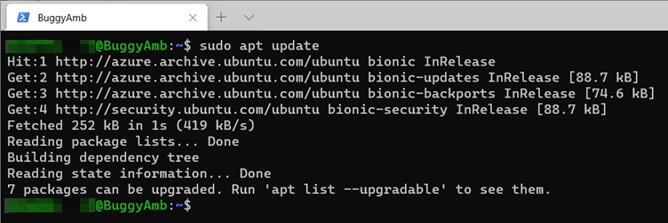
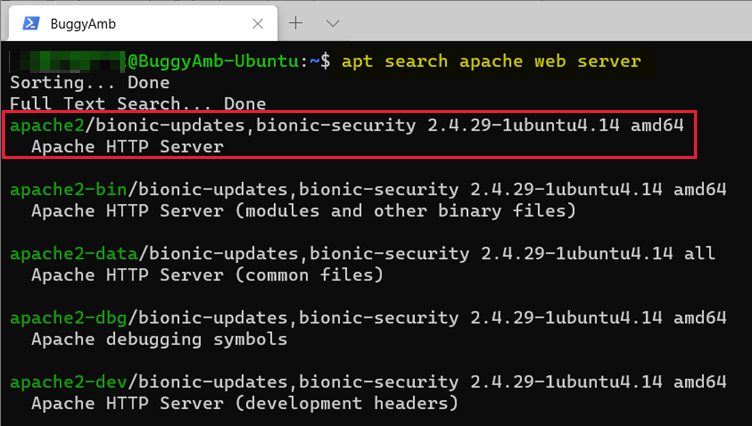
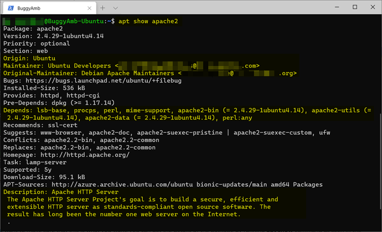
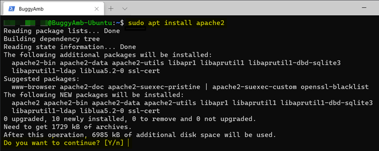
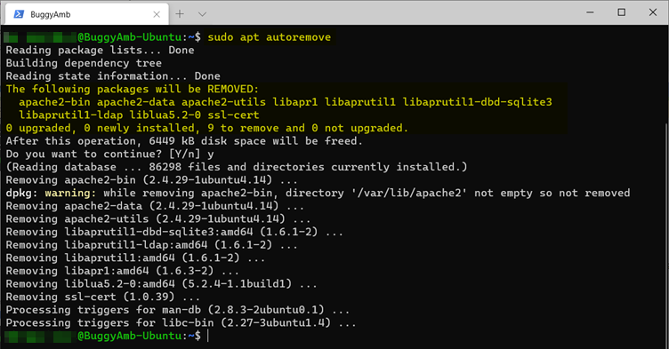

# Part 1.2 - Linux special directories, elevated users, and package managers

_Applies to:_ &nbsp;

**Goal of this part**

This part of the training focuses on Linux special directories, how to run commands as a superuser (root), and how to install and uninstall applications by using package managers.

Using package managers to install and remove packages requires root privileges. Therefore, you must first understand how to run commands as a superuser.

## Linux special directories

For this training, it's not necessary to dive deeply into how to manage Linux. However, a summary of some of the special directories would be useful because you'll use them in the rest of the training.

|Directory|Description|
|---|---|
|/|Root directory (top-level folder).|
|/bin|Contains user binaries, executable files.|
|/sbin|Contains user binaries, executable files.|
|/etc|Contains the configuration files for the local system and applications. For example, you'll create some configuration files in the `/etc/system` directory to enable the ASP.NET Core application to be started automatically by the system.|
|/home|Contains each user's home directory. For example, `/home/<username>`.|
|/tmp|Temporary directory to store temporary files that are created by the system and applications.|
|/usr|Stores shareable files including executables, libraries, and documents. For example, .NET Core runtime and SDKs are installed in the `/usr/share/dotnet/` directory.|
|/var|Stores variable data files. For example, Apache stores the root web site's content in the /var/www/html directory, and the log files in the `/var/log/apache2/` directory. Although it's not necessary, you will publish your web applications in this directory.|
||

> [!NOTE]
> Linux is case-sensitive. Therefore, `/home` and `/Home` are different directories, and filename and Filename are different files.

When you first connect to your Linux virtual machine, you'll start at your root directory. This will be `/home/<username>`.

The root directory shortcut is **~** (tilde). You can use the `cd ~` command at any time to return to the home directory.

Review and try the following commands (shown in the next screenshot):

- `pwd` (print working directory): Prints the current directory and the /etc/systemd directory.
- `echo`: Prints the value of the ~ (root) directory.
- `cd ~`: Returns you to the root directory.


This example doesn't include listing the directory contents. However, a later step in this training covers working with files and folders. Some of those tasks will require superuser permissions. The next section explains how to elevate yourself to superuser status.

## Running commands as a superuser

The superuser is the most privileged user account. It has root (unrestricted) access to all files and folders, and complete control over the operation of the computer. The system administrator uses this account for system maintenance.

On UNIX-like systems, the conventional name of the superuser is "root". The root user can do tasks that are otherwise restricted for standard users, including the following:

- Changing system directories
- Changing user privileges
- Changing file ownership
- System-related tasks such as restarts
- Installation of certain applications

There are several ways to run commands as the root account user. One is to use the `sudo su` command. In this command, `sudo` is short for `superuser do`, and `su` is an abbreviation for "switch user." You can also use the su command to switch between standard users.

> [!IMPORTANT]
> After you become the root account user, everything you do runs in root context. Therefore, you should act carefully because the root account has access to the entire system.

To demonstrate a permissions issue, create a text file in a special folder that's named `/etc`.

The `/etc/` folder is where system configuration files are located. This folder protects its contents from being changed by a standard user.

Run the following command:

```console
echo hello world > /etc/helloworld.txt
```

The `echo` command writes all the text that follows it to the output. The angle bracket (`>`) tells the system to send the output to the `/etc/helloworld.txt` file instead of the console. This is similar to how Windows works.

> [!NOTE]
> Linux is case-sensitive: `Helloworld.txt`, `helloworld.txt` and `helloworld.Txt` are different files.

You don't have to provide a file name extension. The name "helloworld" by itself is perfectly valid. (The "txt" extension is used here only as an example.)

When you run this command, you receive a **permission denied** error message.


The operation fails because the `/etc` folder is special folder that a standard user can't change. Verify the user by running the `id` command.


To become the root account user, run the `sudo su` command.


You should notice two things: When you become root, the dollar sign character (`$`) becomes a pound sign character (`#`). Also, the username is changed to **root**. If you run the same `id` command again, you see that the user and group ID of root are **0**.


> [!IMPORTANT]
> Now you have elevated yourself to the "superuser" role in your session, you have complete access to the system. Keep in mind that this is a potentially dangerous situation, and you should exercise caution as you continue.

Now, run the same command one more time:

```console
echo hello world > /etc/helloworld.txt
```

This time, you don't receive any error message. But is the file actually created? To verify this, run the following command:

```console
ll /etc/hello*
```

The `ll` command lists the files and subfolders that are in a specified folder. In this example, the `/etc/hello*` parameter value limits the command output to the files or folders whose name begins in `hello`.


The output shows that the file was created. What if we want to examine the content of the file? The `cat` command helps here. To see the content, run `cat /etc/helloworld.txt`.


The `cat` command reads files sequentially, and writes their content to the standard output. Therefore, it writes "hello world" in the console.

To prevent mistakes that could damage the system while you're elevated to root status, it's a good practice to exit the root session and return to your standard user session to avoid some dangerous operations. To do this, simply run `exit`. You can see that the pound sign reverts to a dollar sign, and the username is displayed as your standard user.


For additional practice, run the same `ll` and `cat` commands within your standard user context. You'll see that you can't create the file in the `/etc/` folder, but can you list the file and read the contents.

## Running commands by using the "sudo" prefix

Instead of becoming the root account user in your session, you can run commands as root by using the `sudo <command>` format. This approach is safer because it will run the given command only as a superuser.

For example, if you run `restart` while you're not elevated to superuser status, the result is as follows.


To run this command as a superuser instead, you can either change the session context to root (by running `sudo su`) or add the "sudo" prefix, as follows:

```console
sudo reboot
```

Now, the restart operation runs as expected by the virtual machine.


## Package managers

Package managers are used to install, upgrade, and remove applications in Linux. There are several different package managers, such as DPKG (Debian Package Management System), RPM (Red Hat Package Manager), and Zypper for SUSE Package managers themselves are low-level. Therefore, it might be difficult to manage software directly by using the package manager. Fortunately, there are wrappers for these tools that make it easier to install and uninstall software. For example, [yum](https://wikipedia.org/wiki/Yum_(software)) is a wrapper around RPM (Red Hat Package Manager) and [APT](https://wikipedia.org/wiki/APT_(software)) is a wrapper around DPKG (Debian Package Management System).

This tutorial assumes that you're running the [Ubuntu package management system](https://ubuntu.com/server/docs/package-management). This system is derived from the same system that's used by the Debian GNU/Linux distribution. Therefore, we can use APT to install the software.

Depending on your Linux choice, you may have to use other tools. For example, you can use yum to install or uninstall software if you're running Red Hat.

## Upgrading the package manager database

APT works on a database of available packages. We recommend that you update the package managers, and then upgrade the packages after a fresh installation.

To update the package database on Ubuntu, run `sudo apt update`. Notice that the `sudo` prefix is entered before the `apt` command. By doing this, you run the `apt` command as a root user without actually changing the session context to that of the root user.



The update command does not actually upgrade any of the installed software packages. Instead, it updates the package database. The actual upgrade is done by the `sudo apt upgrade` command.


After you type *Y* and then press **Enter**, the packages are upgraded.


## Searching for packages by using package managers

The following example of how to use package managers to search for packages demonstrates the installation and uninstallation of the Apache 2 web server.

Start by searching on "apache web server" by using the `apt search` command. APT does a full text search, and displays the results. You will install Apache HTTP Server by using the package name of `apache2`.



> [!NOTE]
> The use of the command. The `sudo` prefix is not added because you don't have to be a root user to search through packages.
>  
> Instead of doing an `APT search`, you can search in a web browser on "how to install Apache on Ubuntu" to find the package name and the APT command. For this example, you should find [this official Ubuntu document](https://ubuntu.com/tutorials/install-and-configure-apache#2-installing-apache) that clearly explains how to install `Apache 2` on Ubuntu.

## Showing the details of the package

To verify that you have the correct package, run `apt show` to see the package details, as shown in the next screenshot. Again, notice that the `sudo` prefix is not necessary here.



## Listing installed packages and using grep to filter the list

After you determine that the package that you found is the one that you want, you must make sure that it's not already installed on the destination server.

To do this, use the `apt list --installed` command to list the installed applications on the virtual machine. You can also add the [grep](https://www.howtogeek.com/496056/how-to-use-the-grep-command-on-linux/) command to filter the results to show only the applications that contain `apache2`.

> [!NOTE]
> The `grep` command searches a given term in a file. It's a very powerful tool because it provides several options, such as searching by using regex or a string, inverting the search results, ignoring the case sensitivity, searching by using multiple search terms, and recursive search support.

When you run `apt list --installed | grep apache2`, you should see that the package is not installed on the virtual machine.


## Installing the package

Now that you've determined that you've found the desired package and that it's not already installed, you can proceed with the installation. Run the following command:

```console
sudo apt install apache2
```

> [!NOTE]
> This time, we do prefix the command by using `sudo` because this command changes the system. Therefore, it must be the root account to run correctly. The package manager is kind enough to prompt you about whether you really want to really install the application.



Type *Y* (yes), and press **Enter** to install `Apache2`. The package manager will show a progress bar to indicate the status of the installation.


If you run the same `apt list --installed | grep apache2` command again, you see that the Apache 2 package installed together with some other apache2-related packages that are installed automatically.


Although you have just installed Apache 2, you actually have to use Nginx. Therefore, you no longer need Apache, and you can remove that package from the virtual machine.

## Removing packages

Installing a package (in this case, Apache 2) is reversible. You can remove the package if you determine that you don't need it. You have two command options to remove packages:

- `apt remove`: This command removes the binaries but not the configuration file. This is useful if you intend to reinstall the package and want to retain the same configuration.

- `apt purge`: This command removes the binaries and the configuration file.

Remove the package by using `apt remove` as a root user to see the result. To do this, run `sudo apt remove apache2`. When you're prompted to confirm the removal, type *Y*, and then press **Enter**.


The command output tells you the following:

- APT detected that there are packages that were automatically installed and won't be required anymore.
- APT removed only the `apache2` package, and it recommends that you run sudo apt autoremove to remove the associated packages.

List the installed packages again. You see that the `apache2` package is removed but that the automatically installed packages that were provided with it remain installed.


Follow the recommendation to run `sudo apt autoremove` again to remove the leftover packages.



List the installed packages one more time. Now, you should see no apache2-related packages installed.


This procedure is not quite finished. Remember that the difference between `apt remove` and `apt purge` is whether the configuration file is removed. In this exercise, you didn't remove it. So where is it?

Finding the file doesn't involve package managers. Instead, you'll run a standard search for files in Linux. There are several ways to do this. One of the most common search commands is `find`. However, this command is also quite confusing to use, so we won't discuss it here. Instead, we'll use `whereis`.

> [!NOTE]
> Linux is very well documented. Nearly every command has a useful help page available. Use the [man](https://www.geeksforgeeks.org/man-command-in-linux-with-examples/) and [info](https://www.geeksforgeeks.org/info-command-in-linux-with-examples/) commands to show the Help pages in Linux. For example, to learn more on your own about the `find` command, run `man find` or `info find`.

According to the Help page for `whereis`, the definition is as follows:

`whereis` locates the binary, source, and manual files for the specified command names.

If you run `whereis apache2`, you should find the `/etc/apache2` installation.


Remember that the `/etc/` directory is where the system configuration files are located. To learn whether "apache2"is a file or folder, run `ll /etc/apache2`. As you can see, this is a folder, and it contains the apache2 configuration files.


You expect `apache2` to contain these files and folders because you used the `apt remove` command that does not delete the configuration files.

As final step, run the `apt purge` command to see its effect. You can run a purge to clean up the installation folder even after you remove the package. The next screenshot shows that `whereis` did not find anything. This is because the `purge` command removed the configuration files together with the binaries.


**Next steps**: Installing ASP.NET Core and creating an ASP.NET Core application in Linux.

[!INCLUDE [Third-party disclaimer](../includes/third-party-disclaimer.md)]
