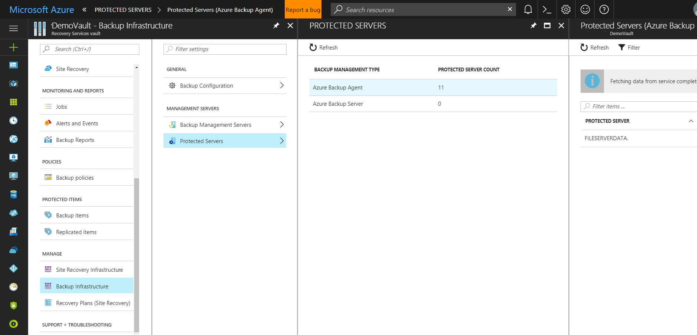
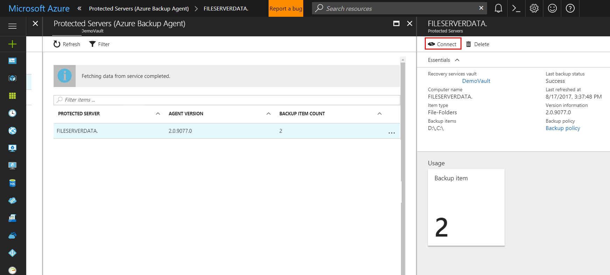

# Mandatory update for Microsoft Azure Recovery Services Agent: September 2019

This article describes important updates, new features, improvements, and fixes for Azure Backup for the Microsoft Azure Recovery Services (MARS) agent version 2.0.9169.0 that is used by both Microsoft Azure Backup and Microsoft Azure Site Recovery (ASR) to transfer data to Azure. We strongly recommend that you download this version to take immediate advantage of critical backup and recovery features and improvements.

_Original product version:_ &nbsp; Azure Site Recovery  
_Original KB number:_ &nbsp; 4515971

## New features

### Expiry time for ad-hoc backups

In this release, customers can specify the expiry time of ad-hoc backups (for both files and system state) instead of defaulting to retention policy settings. This provides greater control on the retention of specific recovery points that may be required for audit and compliance.

### Robocopy to accelerate item-level restores

Customers can now use the Windows native Robocopy tool for higher copy speeds when they recover individual files and folders from the recovery volume through the [Instant Restore](/azure/backup/backup-azure-restore-windows-server#use-instant-restore-to-recover-data-to-the-same-machine) method.

## Improvements

### More robust incremental backups with better tracking of skipped and failed files

MARS agent is now equipped for more resilient incremental backups, even when it encounters files that either are not backed up despite multiple attempts or get skipped because of [unsupported file types](/azure/backup/backup-support-matrix-mars-agent#supported-file-types-for-backup). Additionally, customers can now track skipped files during a backup.

### Enhanced error-reporting to resolve issues effectively

Customers can now directly select hyperlinks that are available in error messages (as opposed to copying them to a browser) to quickly navigate to contextual troubleshooting articles.

## Issues that are fixed in this update

- Fixes an issue that causes backups to be marked incorrectly as initial backup in certain scenarios.
- Adds backup and recovery success improvements for the backup of files and folders.
- Adds accessibility and reliability fixes and improvements.

## Update information

To apply this update, install the latest version of the Microsoft Azure Recovery Services Agent.

The following file is available for download from the Microsoft Download Center:

[Download the Azure Recovery Services agent update package now](https://download.microsoft.com/download/f/7/1/f716c719-24bc-4337-af48-113baddc14d8/MARSAgentInstaller.exe).

The version number for this update of Microsoft Azure Recovery Services Agent is 2.0.9169.0.

**Virus-scan claim**

Microsoft scanned this file for viruses, using the most current virus-detection software that was available on the date that the file was posted. The file is stored on security-enhanced servers that help prevent any unauthorized changes to it.

### Applying the update to multiple servers

If your servers are registered to one or more Recovery Services Vaults, you can update your servers directly from Azure portal. To update multiple servers from the Azure portal, follow these steps:

1. Download the installer package from the Download Center.

1. Navigate to the Recovery Services Vault where your servers are registered.

1. On the **Settings** blade, click **Backup Infrastructure** in the **Manage** section.

1. Click **Protected Servers** under **Management Servers**, and then select **Azure Backup Agent** as the **Backup Management Type**.

    

1. On the blade that appears, select a server for which the Agent version number is earlier than **2.0.9169.0**. On the server’s detail blade, click **Connect**. A Remote Desktop Connection file is downloaded that you can use to connect to the server, copy the update installer, and then run the installer to update the MARS Agent on the server.
  

1. When you're done updating, you can select other servers that have Agent versions that are earlier than **2.0.9169.0**, and then update the Agents on those servers in the same manner.

### Restart information
If you are using Windows Server 2008 (SP2 and R2 SP1, any version), you must restart the computer after you apply this update. Users who installed MARS Agent on other Windows Server versions don’t have to restart the computer after applying this update.

### Prerequisites
If you use System Center 2016 Data Protection Manager (SC DPM), Microsoft recommends that you apply [Update Rollup 1](https://support.microsoft.com/help/3190600) for System Center 2016 Data Protection Manager or a later version.

If you use System Center 2012 R2 Data Protection Manager (SC DPM), apply [Update Rollup 12](https://support.microsoft.com/help/3209592/) for System Center 2012 R2 Data Protection Manager or a later version.
