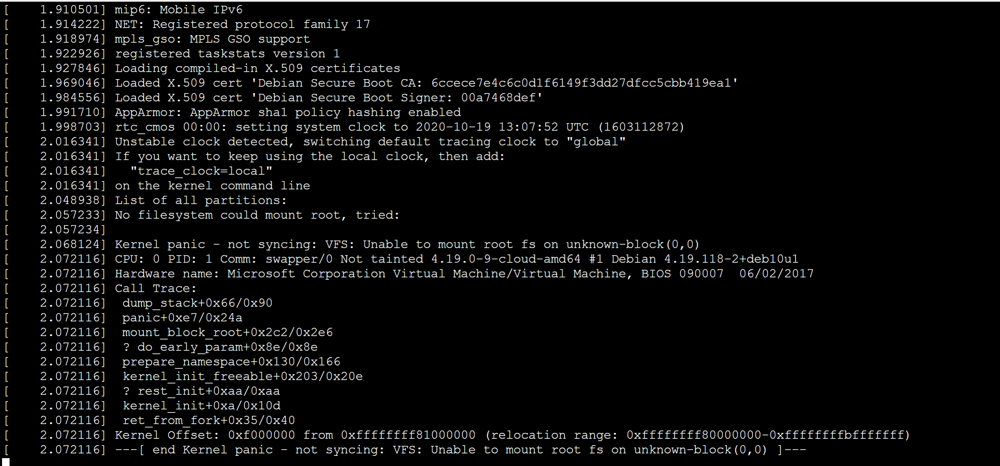

# Use Azure Linux Auto Repair (ALAR) to fix a Linux VM

The next time that you have to run a repair on your Azure Linux virtual machine (VM), you can automate the job by putting the Azure Linux Auto Repair (ALAR) scripts to work for you. You no longer have to run the job manually. These scripts simplify the recovery process and enable even inexperienced users to recover their Linux VM easily.

ALAR is part of the VM repair extension that's described in [Repair a Linux VM by using the Azure Virtual Machine repair commands](./repair-linux-vm-using-azure-virtual-machine-repair-commands.md).

ALAR covers the following repair scenarios:
- Malformed /etc/fstab file:
   - Syntax errors
   - Missing disk
- Damaged initrd or missing initrd line in the /boot/grub/grub.cfg file
- Startup problems caused by a corrupted kernel image
- Incorrect setup for the Linux kernel or GRUB serial console configuration

## The ALAR scripts

### FSTAB

This script strips off any lines in the /etc/fstab file that the system doesn't need to start successfully. The system first makes a copy of the original file.
After the system restarts, the /etc/fstab file can be updated to add lines for the correct mount options.

For more information about problems that are caused by a bad /etc/fstab file, see [Troubleshoot Linux VM starting issues because fstab errors](./linux-virtual-machine-cannot-start-fstab-errors.md). 

### Kernel

This script changes the default kernel. The script replaces the broken kernel with the previously installed version.

For more information about messages that might be logged on the serial console for kernel-related startup events, see [How to recover an Azure Linux virtual machine from kernel-related boot issues](/troubleshoot/azure/virtual-machines/kernel-related-boot-issues).

### Initrd

This script corrects two problems that might occur when a new kernel is installed:
   - The Grub.cfg file is missing an `initrd` line.
   - The initrd image is missing.

Depending on the specific problem, the script either repairs the Grub.cfg file or creates a new initrd image to replace a missing image.

Initrd-related startup problems can appear as the following logged symptoms.




In both cases, the following information is logged before the error entries are logged.


### Serialconsole

This action corrects an incorrect or malformed serial console configuration for GRUB or the Linux kernel. We recommend that you run this action in the following cases
 
- No GRUB menu is displayed at VM startup
- No operating system related information is written to the serial console

## How to use ALAR

The ALAR scripts use the repair extension `run` command and its `--run-id` option. The script-id for the automated recovery is: **linux-alar2**. For example:

```azurecli-interactive
az vm repair create --verbose -g centos7 -n cent7 --repair-username rescue --repair-password 'password!234’ --copy-disk-name  repairdiskcopy
 ```

```azurecli-interactive
az vm repair run --verbose -g centos7 -n cent7 --run-id linux-alar2 --parameters initrd --run-on-repair
 ```

```azurecli-interactive
az vm repair restore --verbose -g centos7 -n cent7
 ```

These steps create a repair task. In the next step, you'll use the `initrd` script to fix an initrd-related startup problem. In the last step, you'll run the restore operation.

  [!NOTE]
> You can pass over either a single recover-operation or multiple operations. For multiple operations, delineate them by using commas without spaces:
   > - ‘fstab’
   > - ‘fstab,initrd’

## Limitations

- Classic VMs aren't supported.

## Next steps

If you experience a bug or want to request an enhancement to the script base of ALAR, post a comment on [GitHub](https://github.com/Azure/repair-script-library/issues).
