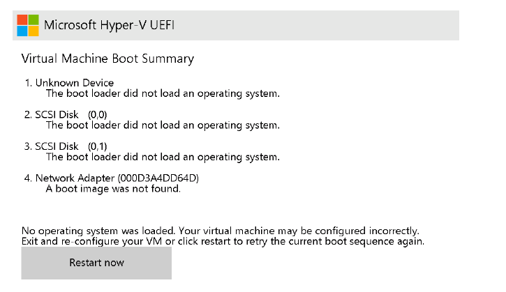
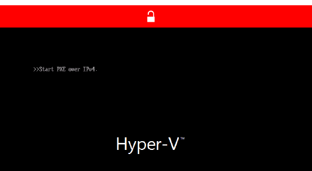

<!---Recommended: Remove all the comments in this template before you sign-off or merge to the main branch.--->

# UEFI Boot errors in Azure Linux VMs

Azure Marketplace Linux Partner Images are configured for both BIOS(Gen1) and UEFI (Gen2) boot and tagged respectively.

This article focuses on multiple scenarios that could lead to boot issues when deploying Generation 2 Linux VMs in Azure. 

## Prerequisites

Access to Azure CLI or [Azure Cloud Shell](https://shell.azure.com) is required to perform an offline repair.


## Symptom description 

The Generation 2  Linux VM boot will fail and the server will be inaccessible.

## How to identify a UEFI Boot issue?

Use the [Boot Diagnostics Screenshot](boot-diagnostics.md) to see the current state of your VM.
 The Linux VM fails to boot with the below error message in boot diagnostics screenshot section:
 
 
 
 

## Scenario 1: Missing UEFI partition in the boot image

The Generation 2 linux VM will fail to boot if the UEFI bootloader partition is missing or has been deleted.

### Resolution for scenario 1

<!---Required: List the steps that should be taken to resolve the problem. --->
In order to resolve such issue, a rescue/repair VM is required to do an offline repair.

1. Use the [**Repair VM** command](repair-linux-vm-using-azure-virtual-machine-repair-commands.md) to create a repair VM that has a copy of the target VM's OS disk attached. 

2. After that, try following methods to fix the EfI partition issue:

```bash
root@repair-centos7:~# gdisk /dev/sdc
GPT fdisk (gdisk) version 1.0.3

Partition table scan:
  MBR: protective
  BSD: not present
  APM: not present
  GPT: present

Found valid GPT with protective MBR; using GPT.

Command (? for help): p
Disk /dev/sdc: 134217728 sectors, 64.0 GiB
Model: Virtual Disk    
Sector size (logical/physical): 512/4096 bytes
Disk identifier (GUID): 9F6127EA-D24D-40DC-AE94-A3151512CD78
Partition table holds up to 128 entries
Main partition table begins at sector 2 and ends at sector 33
First usable sector is 34, last usable sector is 134217694
Partitions will be aligned on 2048-sector boundaries
Total free space is 1019837 sectors (498.0 MiB)

Number  Start (sector)    End (sector)  Size       Code  Name
   1         1026048         3123199   1024.0 MiB  0700  
   2         3123200       134215679   62.5 GiB    8E00  
  14            2048           10239   4.0 MiB     EF02  

Command (? for help): n
Partition number (3-128, default 3): 
First sector (34-134217694, default = 10240) or {+-}size{KMGTP}: 10240
Last sector (10240-1026047, default = 1026047) or {+-}size{KMGTP}: 1026047
Current type is 'Linux filesystem'
Hex code or GUID (L to show codes, Enter = 8300): ef00
Changed type of partition to 'EFI System'

Command (? for help): p
Disk /dev/sdc: 134217728 sectors, 64.0 GiB
Model: Virtual Disk    
Sector size (logical/physical): 512/4096 bytes
Disk identifier (GUID): 9F6127EA-D24D-40DC-AE94-A3151512CD78
Partition table holds up to 128 entries
Main partition table begins at sector 2 and ends at sector 33
First usable sector is 34, last usable sector is 134217694
Partitions will be aligned on 2048-sector boundaries
Total free space is 4029 sectors (2.0 MiB)

Number  Start (sector)    End (sector)  Size       Code  Name
   1         1026048         3123199   1024.0 MiB  0700  
   2         3123200       134215679   62.5 GiB    8E00  
   3           10240         1026047   496.0 MiB   EF00  EFI System
  14            2048           10239   4.0 MiB     EF02  

Command (? for help): w

Final checks complete. About to write GPT data. THIS WILL OVERWRITE EXISTING
PARTITIONS!!

Do you want to proceed? (Y/N): Y
OK; writing new GUID partition table (GPT) to /dev/sdc.
Warning: The kernel is still using the old partition table.
The new table will be used at the next reboot or after you
run partprobe(8) or kpartx(8)
The operation has completed successfully.

```
> [!IMPORTANT]
>
> * Replace /dev/sdc with the corresponding copy of the Operating System (OS) disk device.
> * The partition number choice does not matter as long as the sector start and end points are correct. Normally, the correct sector start and end point is chosen as the OS is able to determine the missing sectors.
> * Ensure that the ending sector is not occupied by any other partition within the disk. Choosing default values should suffice here.

>[!NOTE]
>
> For reference, Azure Linux Partner Images have the following partition number and sector start and end points: 
>

Linux OS Distribution| EFI Partition number|Sector Start|Sector End|
|----------------|--------------------|------------|----------|
| CentOS 7 | 15 |10240 | 1024000 | 
| CentOS 8 | 15 |10240 | 1024000 |
| Debian 10 | 15 | 8192 |262143 |
| Debian 11 | 15 | 8192 |262143 |
| RHEL 7 | 1 |2048 | 1026047 |
| RHEL 8 | 15 |10240 | 1024000 |
| Oracle Linux 7 | 15 |10240 | 1024000 |
| Oracle Linux 8 | 15 |10240 | 1024000 |
| Ubuntu 18.04 | 15 |10240 | 227327 |
| Ubuntu 20.04 | 15 |10240 | 227327 |
| SLES 12 | 2| 6144 | 1054719 |
| SLES 15 | 2| 6144 | 1054719 |


3. Once, the partition has been recreated, restore the VM by swapping the repaired OS disk with the original OS disk of the VM by using [**Repair VM** command](repair-linux-vm-using-azure-virtual-machine-repair-commands.md) again.


## Scenario 2: Corruption of the UEFI boot partition within the image

The VM will also fail to boot due to a corrupted UEFI boot partition.

### Resolution for scenario 2

In order to resolve such issue, a rescue/repair VM is required to do an offline repair.

1. Use the [**Repair VM** command](repair-linux-vm-using-azure-virtual-machine-repair-commands.md) to create a repair VM that has a copy of the target VM's OS disk attached. 
2. After that, try following methods to fix the EFI partition corruption issue:

```bash
root@repair-centos7:~# gdisk -l /dev/sdc
GPT fdisk (gdisk) version 1.0.3

Partition table scan:
  MBR: protective
  BSD: not present
  APM: not present
  GPT: present

Found valid GPT with protective MBR; using GPT.
Disk /dev/sdc: 134217728 sectors, 64.0 GiB
Model: Virtual Disk    
Sector size (logical/physical): 512/4096 bytes
Disk identifier (GUID): 9F6127EA-D24D-40DC-AE94-A3151512CD78
Partition table holds up to 128 entries
Main partition table begins at sector 2 and ends at sector 33
First usable sector is 34, last usable sector is 134217694
Partitions will be aligned on 2048-sector boundaries
Total free space is 4029 sectors (2.0 MiB)

Number  Start (sector)    End (sector)  Size       Code  Name
   1         1026048         3123199   1024.0 MiB  0700  
   2         3123200       134215679   62.5 GiB    8E00  
   3           10240         1026047   496.0 MiB   EF00  EFI System
  14            2048           10239   4.0 MiB     EF02 

root@repair-centos7:~# fsck.vfat -n /dev/sdc3
fsck.fat 4.1 (2017-01-24)
0x25: Dirty bit is set. Fs was not properly unmounted and some data may be corrupt.
 Automatically removing dirty bit.
Leaving filesystem unchanged.
/dev/sdc3: 19 files, 1438/63326 clusters

root@repair-centos7:~# fsck.vfat /dev/sdc3
fsck.fat 4.1 (2017-01-24)
0x25: Dirty bit is set. Fs was not properly unmounted and some data may be corrupt.
1) Remove dirty bit
2) No action
? 1
Perform changes ? (y/n) y
/dev/sdc3: 19 files, 1438/63326 clusters
root@repair-centos7:~# fsck.vfat /dev/sdc3
fsck.fat 4.1 (2017-01-24)
/dev/sdc3: 19 files, 1438/63326 clusters

```
>[!IMPORTANT]
>
> * Replace /dev/sdc with the corresponding copy of the Operating System (OS) disk device.
> * Always take a backup of the OS disk and perform a dry run with "-n" option before performing the above mentioned Filesystem Check
> * dosfsck  command can also be used to perform the vfat filesystem check. Both commands are essentially the same. You can refer to [fsck.vfat](https://linux.die.net/man/8/fsck.vfat) for further information.

3. Once, the partition has been cleaned, restore the VM by swapping the repaired OS disk with the original OS disk of the VM by using [**Repair VM** command](repair-linux-vm-using-azure-virtual-machine-repair-commands.md) again.

## Scenario 3: The entire Boot partition contents is deleted

### Resolution for scenario 3

In case the entire /boot partition or other important contents are missing and cannot be recovered, a [restore from backup](/azure/backup/backup-azure-arm-restore-vms) will be the only option.

[!INCLUDE [Azure Help Support](../../includes/azure-help-support.md)]
