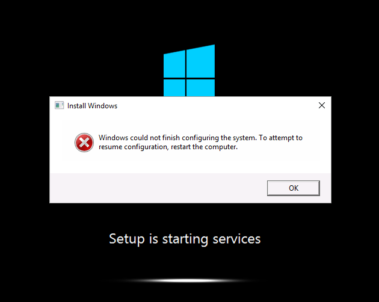

# Troubleshoot Windows could not finish configuring the system

This article provides steps to resolve issues where the Sysprep process prevents the booting of an Azure virtual machine (VM).

## Symptom

When you use [Boot diagnostics](./boot-diagnostics.md) to view the screenshot of the VM, you will see that the screenshot displays an Install Windows error while Windows setup is starting services. The error will display the message:

`Windows could not finish configuring the system. To attempt to resume configuration, restart the computer. Setup is starting services`

  

## Cause

This error is caused when the operating system (OS) is unable to complete the [Sysprep process](/windows-hardware/manufacture/desktop/sysprep-process-overview). This error will occur when you attempt an initial boot of a generalized VM. If you encounter this issue, recreate the generalized image, as the image is in an un-deployable state and cannot be recovered.

## Solution

> [!TIP]
> If you have a recent backup of the VM, you may try [restoring the VM from the backup](/azure/backup/backup-azure-arm-restore-vms) to fix the boot problem.

To fix this issue, follow the [Azure guidance on preparing/capturing an image](/azure/virtual-machines/windows/upload-generalized-managed) and prepare a new generalized image.