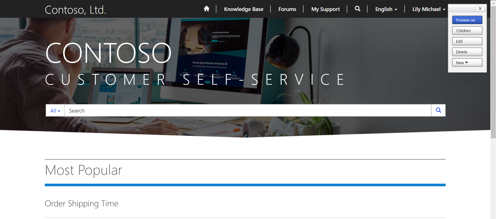
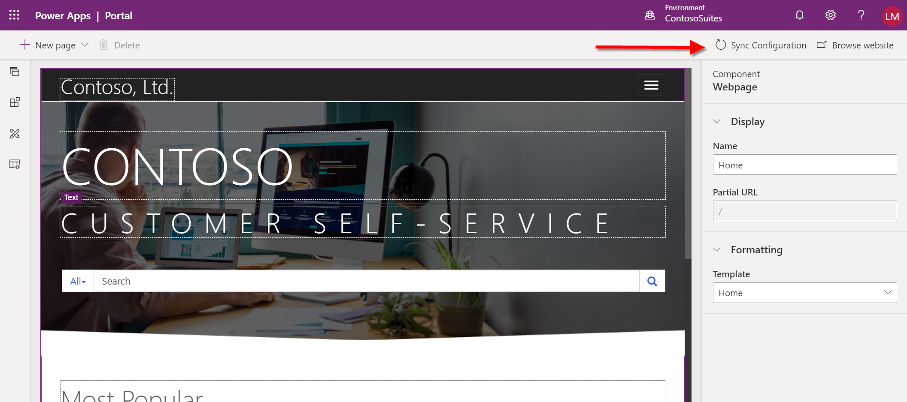

# Chat widget doesn't load on the portal

This article provides a few solutions to an issue when the chat widget doesn't load on the portal in Omnichannel for Customer Service.

## Symptom

Chat widget doesn't load on the portal. 

> [!div class="mx-imgBorder"]
> 

## Causes
There are multiple reasons why this may happen, depending on your configuration. There are five ways to try to resolve the issue.

## Resolution 1: Location option

The Location option for the chat widget might be configured incorrectly.

Delete the location in **Widget location**, and then recreate it.

To delete and add **Widget location** for the chat widget, do the following steps:

1. Sign in to the **Omnichannel Administration** app.
2. Go to **Administration** > **Chat**.
3. Select a chat widget from the list.
4. Select the **Location** tab.
5. Select a record in the **Widget Location** section, and then select **Delete**.
6. Select **Save**.
7. Select **Add** in the **Widget Location** section to add a record. The quick create pane of the chat widget location appears.
8. Specify the following details.

   | Field | Value |
   |---------------------------|-----------------------------------------|
   | Title | Type the title of record. |
   | Value | The website domain where the chat widget must be displayed. The domain format should not include the protocol (http or https). For example, the website is  `https://contoso.microsoftcrmportals.com. Now, the value is  `contoso.microsoftcrmportals.com. | 
10. Select **Save** to save the record.
11. Go to the website and check whether the chat widget loads.

> [!Note]
> The chat widget requires session storage and local storage to be functional in your browser. Make sure you have cookies enabled in your browser so these services can work properly.

## Resolution 2: Remove location

Alternatively, try removing the chat widget location.

> [!div class="mx-imgBorder"]
> 

## Resolution 3: Clear portal cache

Clear the portal cache by doing the following steps:

1. Go to your portal and sign in as a portal administrator.

    > [!div class="mx-imgBorder"]
    > 

2. Add the following text to the end of your portal URL:

      /_services/about

    For example: 

      https://contoso.powerappsportals.com/_services/about

3. Select **Clear cache**.

    > [!div class="mx-imgBorder"]
    > 

4. Reload the portal.

   Also, make sure that your web browser allows third-party cookies. 

## Resolution 4: Sync portal configurations

To sync portal configurations, do the following steps: 

1. Go to [https://make.powerapps.com](https://make.powerapps.com).

2. Find and select your portal, and then choose **Edit**.

    > [!div class="mx-imgBorder"]
    > 

3. Select **Sync Configuration**.

    > [!div class="mx-imgBorder"]
    > 

## Resolution 5: Restart portal

Restart the portal by doing the following steps:

1. Go to [https://make.powerapps.com](https://make.powerapps.com).

2. Select your portal, and then under **Advanced options**, choose **Settings > Administration**. 

    > [!div class="mx-imgBorder"]
    > 

3. Select **Restart**.

    > [!div class="mx-imgBorder"]
    > 
