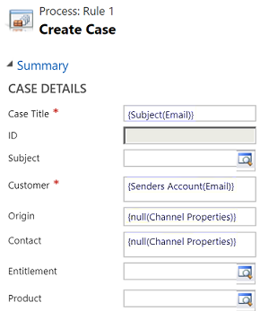
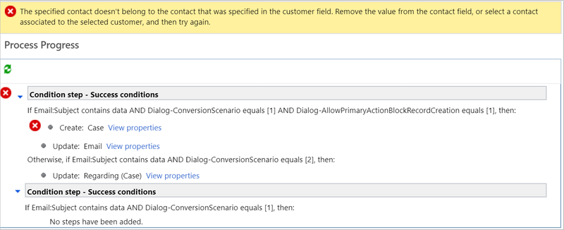

# Troubleshoot common email error messages 

This article provides solutions to common email error messages.

## Scenario
**Sample**: Configuration on Automatic Record Creation and Update Rule
- **Create contact for unknown sender** box should be checked.
- Set condition criteria to **Any incoming email**.
- Add action to create case, select **View properties** and set the case fields as per business use case.

## Error 1

In the Customer field of the Case Details section, **Senders Account (Email)** is set as below value.

This results in the following error in system jobs:

## Resolution 1

To resolve this issue, keep the Customer field blank or set it to **{Sender(Email)}**. This allows the system to automatically create contact for the unknown sender and link it to the case.

## Error 2

The Customer field is set as **{Senders Account(Email)}** and Contact field as **{Sender(Email)}**.

This results in the following error in system jobs:

## Resolution 2

To resolve this issue, keep the Customer field blank or set it to **{Sender(Email)}**. This allows the system to automatically create contact for the unknown sender and link it to the case.

## Error 3

The Customer field and Contact field are set as **{Sender(Email)}**.

This results in the following error in system jobs:

## Resolution 3

To resolve this issue, leave contact field blank and set Customer field either to blank or to **{Sender(Email)}**.

## Validation steps

You must validate the configuration and validation steps given in the following table to understand the main cause of the issue, and resolve it:

|Option in Automatic Record Creation and Update Rule in Service Management  |If selected as  |Validation steps  |Outcome  |
|---------|---------|---------|---------|
|Create a case if a valid entitlement exists for the customer     |  Yes     |  Validate that an active entitlement exists for the customer. Valid active entitlement is evaluated as below:    - If the sender of the email is a contact with a parent account, then Dynamics 365 Customer Service creates a case if the contact’s parent account has a valid entitlement, and the contact is listed in the Contacts section of the entitlement   OR   - If the Contacts section is empty (which means that the entitlement is applicable to all contacts for the customer) |   A case is created      |
|Create a case from an email sent by unknown senders     |   Yes       |        For any incoming email from an unknown sender |     - A case is created    - A contact is also created for the unknown sender|
|     |   Yes      |    For an incoming email with email address of inactive account or contact     |   - A case is created   - An inactive account or contact is activated|
|     |   No      |     For an incoming email with email address of active account or contact   |  A case is created       |
|    |     No    |      For an incoming email sent by record type other than account or contact   |    No case is created     |
|  |   No      |     For an incoming email with email address of inactive account or contact    |  No case is created           |
|Create a case for activities associated with a resolved case     |    Yes     |   For an incoming email related to a resolved case      |    A case is created     |
|   |    Yes      |   For an incoming email related to an active case         |   No case is created      |
|  |         |         |         |
 
