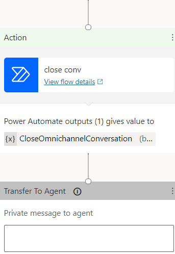
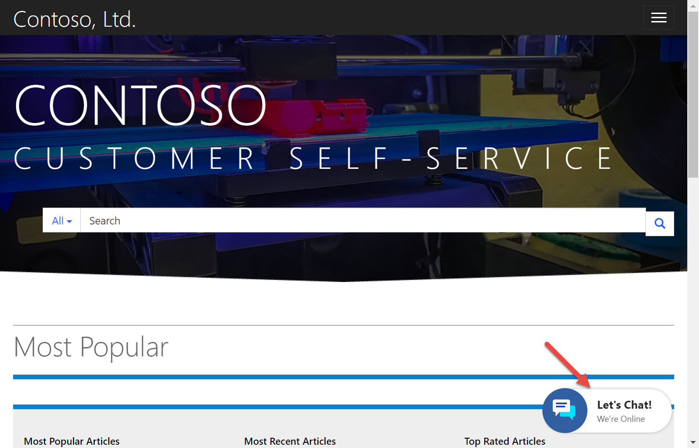
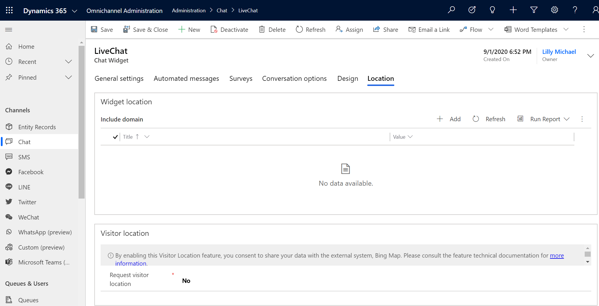
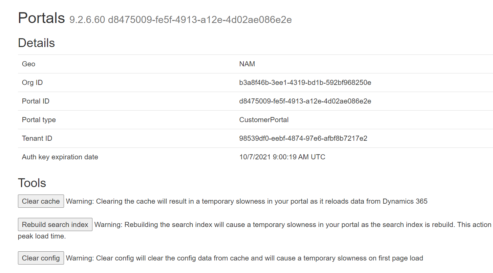

# Troubleshoot issues with chats in Omnichannel for Customer Service

This article helps you troubleshoot issues with using the chat features in Omnichannel for Customer Service

## Issue 1 - Power Virtual Agents bot conversations appear as active on dashboard after customer has ended chat

### Symptom

After a conversation has ended, the Power Virtual Agents bot conversations are still showing as active on the dashboard.

### Cause

Conversations for Power Virtual Agents bot can't be ended in Omnichannel for Customer Service, and therefore will be seen as active on the supervisor dashboard even after they've been closed.

### Resolution 

You can configure a context variable that will explicitly end the bot conversation in Omnichannel for Customer Service after customers close the chat window. In Power Virtual Agents, create a standalone topic for CloseOmnichannelConversation context variable with the variable property set to global. Invoke the topic in another topic that you've configured for the bot.

Though the conversation will be closed in Omnichannel for Customer Service, it will not be closed in Power Virtual Agents and appear in the **Escalation rate drivers** KPI in **Power Virtual Agents Analytics** dashboard.

> [!IMPORTANT]
> Make sure that you have access to Power Automate to configure a flow so that the bot conversation in Omnichannel for Customer Service can be ended.

To configure ending a bot conversation, perform the following steps:

1. In Power Virtual Agents, for the selected bot, configure a new topic.
2. Select **Go to authoring canvas**, and in **Add node**, select **Call an action**, and then select **Create a flow**.
3. On the Power Automate window that opens on a new tab, do the following steps:
   1. In the **Return value(s) to Power Virtual Agents** box, select **Add an input**, and then select **Yes/No**.
   2. In the **Enter title** box, enter CloseOmnichannelConversation, which is the Omnichannel for Customer Service context variable name.
   3. In the **Enter a value to respond** box, select the **Expression** tab, and then enter **bool(true)** to build the expression, and select **OK**.
   4. Save the changes, and then exit Power Automate.
4. In the topic that you were editing, select **Call an action** again, and then in the list, select the flow that you created. 
5.  In **Add node**, select **End the conversation**, and then select **Transfer to agent**.
        > 
6. Go to the topic in which you need to invoke the topic for ending the bot conversation in Omnichannel for Customer Service, and use the **Go to another topic** option in **Add a node**.
7. Select the topic that you created for ending the bot conversation.
8. Save and publish the changes.

Additionally, you can configure automated messages in Omnichannel for Customer Service that will be displayed to the customer after the conversation ends.

## Issue 2 - Chat widget icon doesn't load on the portal

### Symptom

The chat icon doesn't load on the portal. The chat icon URL that was configured as default doesn't load.

### Resolution

You can use an icon of your choice by specifying the link of the icon in the **Chat widget** configuration page. Perform the steps outlined in [Configure a chat widget](add-chat-widget.md#configure-a-chat-widget).

## Issue 3 - Chat isn't initiated when starting a new chat from portal

### Symptom

A message stating "Sorry, we're not able to serve you at the moment" is shown to the customers when they start a chat on the portal. 

### Cause

The issue might be caused by one of the following scenarios:

- Agents aren't configured in the queue.
- Allowed Presence is not updated in the work stream: The default work streams that are shipped out-of-the-box don't have **Allowed Presence** values in the workstream.

   > [!div class=mx-imgBorder]
   > 

### Resolution

As an administrator, make sure of the following details:

- Check that agents have been added to the queues. For information on adding agents to queues, see [Create queues in Omnichannel admin center](queues-omnichannel.md#create-a-queue-for-unified-routing)

- For the associated workstream, check that the **Allowed Presence** option has values in the **Work distribution** area. More information: [Configure work distribution](create-workstreams.md#configure-work-distribution)

## Issue 4 - Chat widget doesn't load on the portal

### Symptom

Chat widget doesn't load on the portal. 

> [!div class="mx-imgBorder"]
> 

### Causes
There are multiple reasons why this may happen, depending on your configuration. There are five ways to try to resolve the issue.

### Resolution 1: Location option

The Location option for the chat widget might be configured incorrectly.

Delete the location in **Widget location**, and then recreate it.

To delete and add **Widget location** for the chat widget, do the following steps:

1. Sign in to the **Omnichannel Administration** app.
2. Go to **Administration** > **Chat**.
3. Select a chat widget from the list.
4. Select the **Location** tab.
5. Select a record in the **Widget Location** section, and then select **Delete**.
6. Select **Save**.
7. Select **Add** in the **Widget Location** section to add a record. The quick create pane of the chat widget location appears.
8. Specify the following details.

   | Field | Value |
   |---------------------------|-----------------------------------------|
   | Title | Type the title of record. |
   | Value | The website domain where the chat widget must be displayed. The domain format should not include the protocol (http or https). For example, the website is  `https://contoso.microsoftcrmportals.com. Now, the value is  `contoso.microsoftcrmportals.com. | 
10. Select **Save** to save the record.
11. Go to the website and check whether the chat widget loads.

> [!Note]
> The chat widget requires session storage and local storage to be functional in your browser. Make sure you have cookies enabled in your browser so these services can work properly.

### Resolution 2: Remove location

Alternatively, try removing the chat widget location.

> [!div class="mx-imgBorder"]
> 

### Resolution 3: Clear portal cache

Clear the portal cache by doing the following steps:

1. Go to your portal and sign in as a portal administrator.

    > [!div class="mx-imgBorder"]
    > 

2. Add the following text to the end of your portal URL:

      /_services/about

    For example: 

      https://contoso.powerappsportals.com/_services/about

3. Select **Clear cache**.

    > [!div class="mx-imgBorder"]
    > 

4. Reload the portal.

   Also, make sure that your web browser allows third-party cookies. 

### Resolution 4: Sync portal configurations

To sync portal configurations, do the following steps: 

1. Go to [https://make.powerapps.com](https://make.powerapps.com).

2. Find and select your portal, and then choose **Edit**.

    > [!div class="mx-imgBorder"]
    > 

3. Select **Sync Configuration**.

    > [!div class="mx-imgBorder"]
    > 

### Resolution 5: Restart portal

Restart the portal by doing the following steps:

1. Go to [https://make.powerapps.com](https://make.powerapps.com).

2. Select your portal, and then under **Advanced options**, choose **Settings > Administration**. 

    > [!div class="mx-imgBorder"]
    > 

3. Select **Restart**.

    > [!div class="mx-imgBorder"]
    > 

## Issue 5 - Error occurs when trying to create a chat widget or social channel

### Symptom

Omnichannel solutions are installed in your environment when you receive a new trial organization. However, when you try to create a chat widget, Facebook page, or social channel in the Omnichannel Administration app, error messages similar to the following messsages might be displayed:

- An error occurred in the PreLiveChatConfigCreatePlugin plug-in.
- An error occurred in the PostOperationFacebookCreatePlugin plug-in.

### Cause

These errors occur because though the solutions are already installed in your environment, they need to be activated before you can start using them.

### Resolution

To provision the solutions, perform the steps outlined in [Provision Omnichannel for Customer Service](omnichannel-provision-license.md).

## Issue 6 - Agent isn't receiving chat in Omnichannel for Customer Service

### Symptom

As an agent, you aren't receiving chat in the Omnichannel for Customer Service app. The issue is caused when you receive the chats in Customer Service Hub app.

### Resolution

You must remove the Customer Service Hub app from the channel provider configuration in the Channel Integration Framework app.

1. Sign in to **Channel Integration Framework**.
2. Select the record that is related to omnichannel.
3. Remove **Customer Service Hub** from the **Select Unified Interface Apps for the Channel** section.
4. Select **Save** to save the record.

## Conversation is stuck in wrap-up state

### Issue

As an agent or a supervisor, you see that some conversations are stuck in the wrap-up state in your Omnichannel Agent Dashboard or Omnichannel Ongoing Conversations Dashboard.

### Cause

The primary agent assigned to the conversation may not have closed it in the session panel.

### Resolution

When conversations are ended by the agent or customer, they transition to the wrap-up state. In order to close the conversation, the primary agent assigned to the conversation needs to close the conversation in the session panel. To learn more about closing sessions, see [Manage sessions in Omnichannel for Customer Service](./oc-manage-sessions.md#close-a-session). To learn more about the wrap-up conversation state, see [Understand conversation states in Omnichannel for Customer Service](./oc-conversation-state.md#wrap-up).
