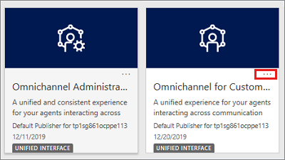
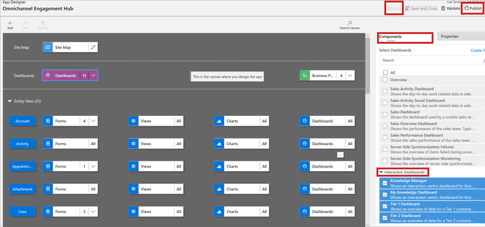

# Troubleshoot issues with dashboards in Omnichannel for Customer Service

This article helps you troubleshoot issues with using the chat features in Omnichannel for Customer Service

## Issue 1: Dashboards do not appear in Omnichannel for Customer Service active dashboards view

### Symptom

When you use the Omnichannel for Customer Service app on Unified Service Desk or on web, the **Active Omnichannel Agent Dashboard** view doesn't show certain dashboards like Tier 1 Dashboard, Tier 2 Dashboard, Knowledge Manager, and My Knowledge Dashboard.

### Resolution

As a system customizer or administrator, you must manually add these dashboards using app designer.

To add the dashboards using app designer, follow these steps:

1. Go to `https://<orgURL>.dynamics.com/apps`.
2. Select the ellipsis (**...**) button in the **Omnichannel for Customer Service** app tile.  
    
3. Select **OPEN IN APP DESIGNER**. The App Designer opens in a new tab.
4. Select **Dashboards** in the canvas area. The **Components** pane in the right side shows the list of **Classic Dashboards** and **Interactive Dashboards**.
5. Select the following dashboards under **Interactive Dashboards**. 
    - Knowledge Manager
    - My Knowledge Dashboard
    - Tier 1 Dashboard
    - Tier 2 Dashboard  
    
6. Select **Save** and then select **Publish**.

## Issue 2: Agent dashboard isn’t loading or is giving an authorization error

### Symptom

The agent dashboard won't load or gives an authorization error.

### Cause

The issue might happen due to the following reasons:

- Azure Active Directory consent is not available for Omnichannel for Customer Service app.
- Agent doesn't the Omnichannel agent role privileges.
- Agent is not assigned to any queue.

### Resolution

Perform the following steps:

- Contact your administrator to verify that Azure Active Directory consent is given to the Omnichannel for Customer Service application on your tenant. Go to [Authorize access](https://go.microsoft.com/fwlink/p/?linkid=2070932) to get access. To learn more, see [Provide data access consent](omnichannel-provision-license.md#provide-data-access-consent).
- Ensure the agent account has the role **Omnichannel Agent**. For more information about the relevant roles, see [Understand roles and their privileges](add-users-assign-roles.md#understand-roles-and-their-privileges). 
- Ensure the agent account is assigned to at least one queue in the Omnichannel Administration app. To learn more, see [Manage users in Omnichannel for Customer Service](users-user-profiles.md).

## Issue 3: An error occurred in the communication panel

### Symptom

After you sign in to the Unified Service Desk client application, you see the following error message.

**An error occurred in the Communication panel. Restart Unified Service Desk and try again. (Error Code - AAD_ID_MISMATCH - Azure ADID mismatched with logged-in user id)**

   > [!div class=mx-imgBorder]
   > 

### Cause

When signing in to Unified Service Desk, you must enter the Customer Service app credentials to sign in, and then again, you're shown a dialog to enter credentials to connect to Dataverse server. If you enter different credentials, this issue occurs. 

### Resolution

If you use **Chrome process** to host applications, go to `C:\Users\<USER_NAME>\AppData\Roaming\Microsoft\USD` and delete the **CEF** folder. Now, sign in to Unified Service Desk client application and try again.

## Issue 4: Communication panel doesn't load in Omnichannel for Customer Service app

### Symptom

The communication panel doesn't load in Omnichannel for Customer Service app.

### Cause

The panel doesn't load when:

- A record doesn't exist in the Channel Integration Framework app.
- Configurations don't sync.

### Resolution

- Create a Channel Integration Framework record with the following values. 

   | Field | value |
   |-------------------------------------------|--------------------------------------------------|
   | Name | Omnichannel |
   | Label | Omnichannel |
   | Channel URL | \<Chat control cdn url>?uci=true&env=`<env>`&ocBaseUrl=\<oc endpoint\>&ucilib=\<crm org url\>/webresources/Widget/msdyn_ciLibrary.js |
   | Enable Outbound Communication | No |
   | Channel Order | 0 |
   | API Version | 1.0 |
   | Select Unified Interface Apps for the Channel | Omnichannel for Customer Service |
   | Select the Roles for the Channel | <li>Omnichannel administrator</li>  <li>Omnichannel agent</li> <li>Omnichannel supervisor</li> |

   To learn how to create a record, see [Configure a channel provider for your Dynamics 365 organization](/dynamics365/customer-engagement/developer/channel-integration-framework/configure-channel-provider-channel-integration-framework).

- To sync the configurations, remove the channel and roles, add them again and save the record.

   1. Sign in to the Dynamics 365 apps.
   2. Select the dropdown button on Dynamics 365 and select **Channel Integration Framework**.
   3. Select the **Omnichannel** record from the list.
   4. Remove **Omnichannel for Customer Service** from the **Select Unified Interface Apps for the Channel** section.
   5. Add **Omnichannel for Customer Service** again in the **Select Unified Interface Apps for the Channel** section.
   6. Remove **Omnichannel agent**, **Omnichannel supervisor**, and **Omnichannel administrator** from the **Select the Roles for the Channel** section.
   7. Add **Omnichannel agent**, **Omnichannel supervisor**, and **Omnichannel administrator** again in the **Select the Roles for the Channel** section.
   8. Select **Save** to save the record.
   9. Sign in to the Omnichannel for Customer Service app and check whether the communication panel loads.

## Issue 5: Conversation control becomes blank

### Symptom

The conversation widget becomes blank while swapping between browser tabs in Google Chrome or Chromium-based Microsoft Edge.

### Cause
The browser version is outdated.

### Resolution

Upgrade your browser version as per the system requirements of Dynamics 365 Channel Integration Framework version 2.0. To learn more, see [System requirements](channel-integration-framework/v2/system-requirements-channel-integration-framework-v2.md).

## Issue 6: After Omnichannel for Customer Service is provisioned, I get an authentication error on the agent dashboard. 

### Symptom

The following error message is displayed on the agent dashboard after I provision Omnichannel for Customer Service:

**Something went wrong while authenticating—please try again. If this continues, have your administrator contact Microsoft Support with the client session ID.**

### Cause

The issue occurs when you rename the org URL but don’t update the channel URL after you've provisioned Omnichannel for Customer Service.

### Resolution

1. Go to [https://make.powerapps.com](https://make.powerapps.com).

2. On the left pane, select **Apps**, and then from the applications list, select **Omnichannel for Customer Service**. 
3. Select the ellipsis (...) button, scroll down the list, and select **App profile manager**.

4. Select the admin app like Customer Service admin center, and then select **Channel provider**.
   The Active Channel Providers list is displayed.

5. Do the following steps:
    - Make sure that the omnichannel channel provider record is listed and is in the active state. 
     If the omnichannel record isn't active, select the record, and then select **Activate** on the menu bar.
    - On the **General** tab of the omnichannel record, make sure that the **Channel URL** field includes the org information as shown in the following example:  
   `https://oc-cdn-ocprod.azureedge.net/convcontrol/ChatControl.htm?uci=true&clientName=zfp&cloudType=Public&env=prod&ocBaseUrl=https://org749544d7-crm.omnichannelengagementhub.com&ucilib=https:// <org>.crm.dynamics.com/webresources/Widget/msdyn_ciLibrary.js`
