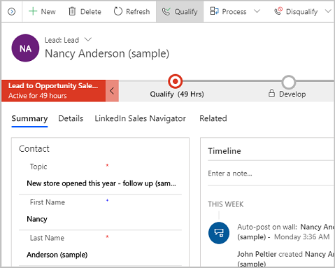
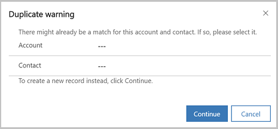
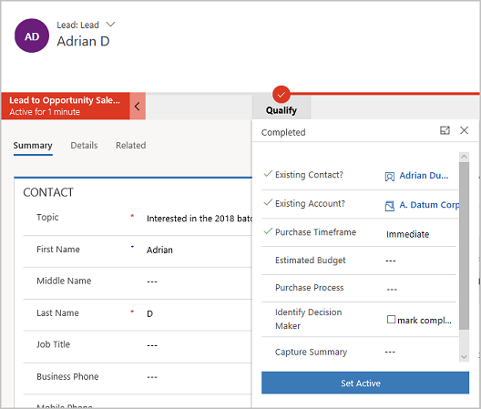
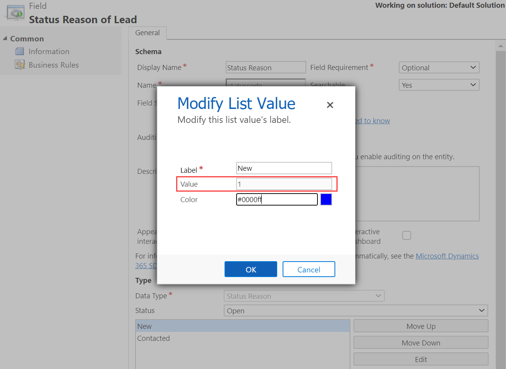
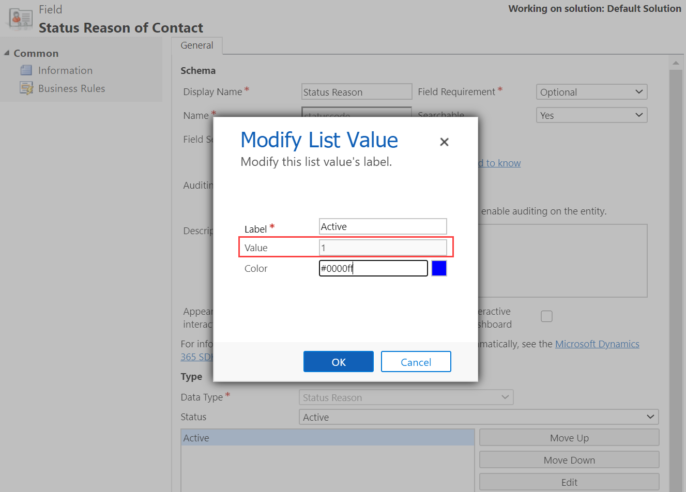
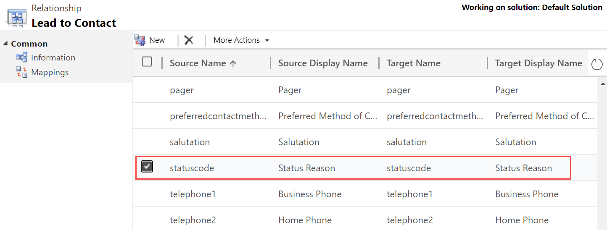

# Troubleshooting lead qualification issues for salespeople

This article helps you troubleshoot and resolve lead qualification issues for salespeople.

## How do I convert or qualify my leads?

You qualify a lead when you determine that the lead you've nurtured has a potential to turn into business. When you qualify a lead, it becomes an opportunity.

To qualify a lead, select **Qualify** on the command bar of the lead record.

> [!div class="mx-imgBorder"]  
> 

You can also qualify a lead from the list of leads. Go to **Sales** > **Leads**. Select the lead you want to qualify and on the command bar, select **Qualify**.

## Issue: I can't qualify a lead.

There are multiple errors you can get while qualifying a lead. 
1.  [Duplicate warning – There might already be a match for this account or contact. If so, please select it.](#duplicate)
2.  [To move to the next stage, complete the required steps](#CompleteSteps)
3.  [Active stage is not on 'lead' entity](#NoActiveStage)
4.  [Access denied or Insufficient permissions](#AccessDenied)
5.  [The lead is closed. You cannot convert or qualify a lead that is already closed.](#LeadClosed)
6.  [Invalid status code error](#invalid-status-code) for a contact or an opportunity
7.  [Can't proceed to the next stage when I select **Next stage** on the business process flow.](#cant-proceed-to-next-stage)

The following sections describe each of these errors and how you can resolve them.

### 1. Duplicate warning – There might already be a match for this account or contact. If so, please select it.

> [!div class="mx-imgBorder"]  
> 

#### Cause

When the lead is qualified to an opportunity, a corresponding account or contact is created. There might already be a match for this account or contact.

#### Solution

In the **Duplicate warning** dialog box, select the existing account or contact to avoid creating duplicates. To create a new record instead, select **Continue**.

> [!NOTE]
> When you qualify a lead through the Leads grid, the system creates an account or contact even though a duplicate record exists. By design, the rule that detects the duplicate records gets disabled. However, when you qualify a lead through the lead record form, the duplicate detection rule works. The rule prompts you with a warning to resolve the conflict if any duplicate records for account or contact are found.

### 2. To move to the next stage, complete the required steps.

#### Cause

You haven't filled in data in all the business-required fields in the current stage of the process stage.

#### Solution

Fill in data in all the mandatory fields in the current stage, save the record, and then try qualifying the lead again.

### 3. Active stage is not on 'lead' entity

#### Cause

The lead that you're trying to qualify isn't in the Active state. This might happen when an already qualified lead has been reactivated.

#### Solution

1. Open the lead record.
2. On the process stage, select the **Set Active** button.

    > [!div class="mx-imgBorder"]  
    > 

 
### 4. Access denied or Insufficient permissions

#### Cause

You don't have sufficient permissions on the lead record. 

#### Solution

Ask your system administrator to grant you the necessary permissions.
If there's no error, and you're still not able to qualify a lead, contact the technical support.

### 5. The lead is closed. You cannot convert or qualify a lead that is already closed.

#### Cause

You are trying to qualify or disqualify a lead that's closed. 

#### Solution

Make sure the lead that you're trying to qualify or disqualify is open and not already qualified or disqualified. You can do this by selecting the My Open leads or Open Leads view.

### 6. Invalid status code error for a contact or an opportunity.

#### Cause

When you qualify a lead, some of the attributes in the mapping of 1:N (one-to-many) relationships between **Lead to Contact** or **Lead to Opportunity** are copied from the Lead to Contact or Lead to Opportunity entities.

Status codes are defined as an option set. This issue occurs when a user adds a new option to the option set in the Lead entity, but not to the option set in the target entity.

For entity mapping to work, option sets&mdash;such as status codes&mdash;should be the same between lead and contact or lead and opportunity, because the lead qualification process copies the status code value from lead to contact or from lead to opportunity. If the status codes don't match, the process fails.

#### Solution

Ensure that the status codes of Lead and Contact entities, or Lead and Opportunity entities, are the same.

**To see the status codes of the Lead entity and the target entity**

1. In the Sales Hub app, go to **Settings** > **Customizations** > **Customize the System**.

2. Expand the Lead entity node, and select **Fields**.

3. Find the **statuscode** field, and double-click to open it.

4. Double-click a status to see its value.

    > [!div class="mx-imgBorder"]
    > 

5. Repeat steps 2 through 4 to see the status code for the target entity (for example, Contact).

    > [!div class="mx-imgBorder"]
    > 

**To see mappings**

1. In the Sales Hub app, go to **Settings** > **Customizations** > **Customize the System**.

2. Expand the Lead entity node, and select **1:N Relationships**.

3. Open the required relationship, and select **Mappings** in the left pane.

4. Scroll to see the mapping.

    > [!div class="mx-imgBorder"]
    > 

5. If you don't see the required mapping, select **New** to create it.

> [!NOTE]
> - If you're still getting the error, remove the mapping of the status code between the Lead entity and the target entity (Account, Contact, or Opportunity).
> - To add new status codes that have the same values, import the new option set values through a managed solution for the Contact or Opportunity entity.

### 7. Can't proceed to the next stage when I select **Next stage** on the business process flow (lead to opportunity sales process).

#### Cause

This is by design. When you haven't qualified the record, there will be no opportunity associated with it and you can't proceed to next stage.  

#### Solution
 
To resolve this issue, you must qualify the lead. Qualifying the lead automatically moves the lead to next stage (creating an opportunity). 

