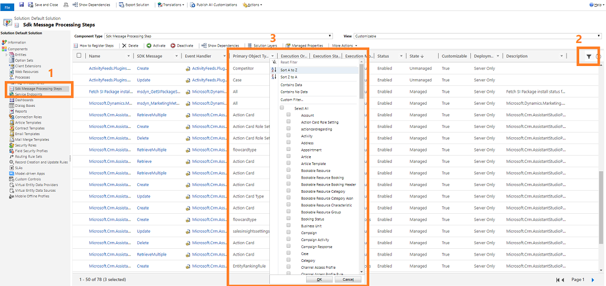
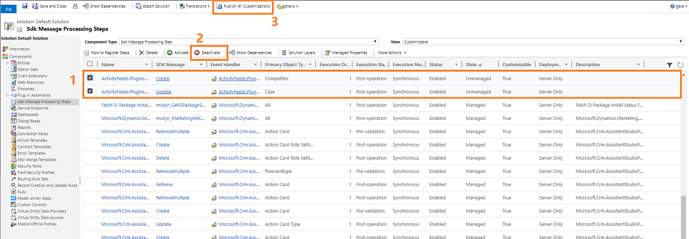
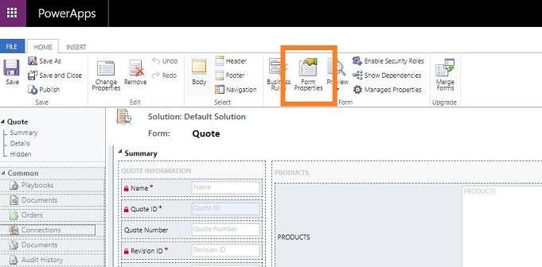
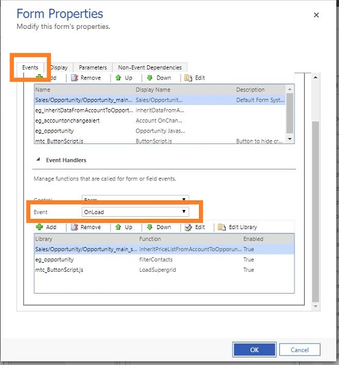
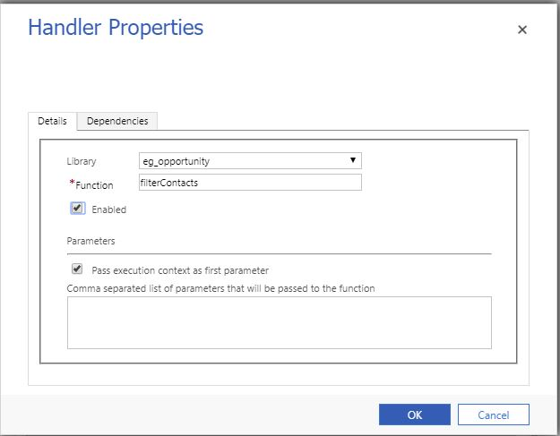
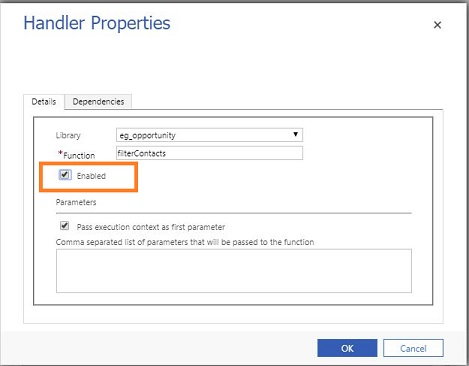
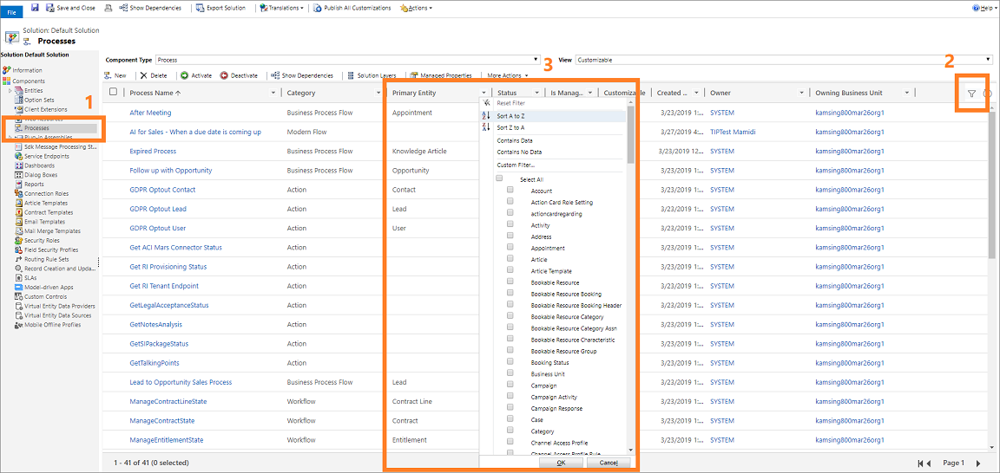

# Troubleshooting common issues across multiple tables  

This article helps you troubleshoot and resolve common issues across multiple tables like opportunity, quote, order, or invoice.

## Issue: In Context Form may appear in the form selector

The **In Context Form** is used for displaying and customizing the side panel in deal manager, and in the new interface for contacts, opportunities, leads, and accounts.

### Cause

If your environment has any customization that sets the **formActivationState** to **Active** for these tables, the **In Context Form** appears in the form selector dropdown and lets users select this form for viewing the record details. 

:::image type="content" source="media/sales/form-selector.PNG" alt-text="Form selector showing incontext form":::

### Solution

If the appearance of **In Context Form** leads to confusion, you can deactivate the **In Context Form** as shown in the following screenshot. 

:::image type="content" source="media/sales/deactivate-incontext-form.PNG" alt-text="Screenshot of In Context form with the option to deactivate":::

## Issue: Error or unexpected behavior while working on tables 

### Symptom

While working on tables (such as opportunities, quote, order, invoice, quote product, and order product), you observe unexpected behavior or an error in Dynamics 365 for Sales. The following are some of the errors that you might encounter while working on opportunities, and they might apply to other tables:

- "Extended Amount is wrong after revising quote"- this error might occur due to a custom plug-in.
- "Error while saving the opportunity" - this error might occur due to custom JavaScript.
- "Error while close opportunity" - this error might occur due to a custom workflow.

### Cause

These issues might occur due to improper customization of the application. 

### Solution

You must verify the improper customizations and resolve them. Perform the following verification methods to identify which customization is causing the issue, and then resolve:

- [Deactivate a custom plug-in](#deactivate-custom-plug-in)
- [Disable custom JavaScript](#disable-custom-javascript)
- [Deactivate a custom workflow process](#deactivate-custom-process)

#### Deactivate a custom plug-in

1. Go to **Settings** > **Customizations** > **Customize the System**.
2. Select **Sdk Message Processing Steps**. 

   A list of available SDK message processing steps is displayed.

3. Select the **Filter** icon, select the column **Primary Object Type Code (Sdk Message Filter)**, and then select the table for which the error is occurring.
    
    > [!div class="mx-imgBorder"]
    > 

4. Select the SDK message processing steps that are coming from the solutions owned by you. 

    > [!NOTE]
    > To view your custom SDK message processing steps:
    > <ol><li>Go to <b>Settings</b> > <b>Solutions</b>, and then open the solution.</li>
    > <li>Select <b>SDK Message Processing Steps</b>. Verify that the values are selected as follows:  <b>Component Type</b> to <b>SDK Message Processing Step</b>, and <b>View</b> to <b>All</b>.</li></ol>

5. Select **Deactivate**.
6. Publish the customizations.
 
    > [!div class="mx-imgBorder"]
    > 

7. Verify the issue and if it doesn't occur, the issue is with the custom SDK message processing steps. Resolve the issue.

> [!NOTE]
> If the issue occurs, activate the **SDK Message Processing Steps** that you deactivated now and try to [disable custom JavaScript](#disable-custom-javascript) or [deactivate a custom workflow process](#deactivate-custom-process).

#### Disable custom JavaScript

1. Open the form editor of the table in which the error is occurring. In this example, we're selecting the table as Opportunities and the default solution form.

    > [!div class="mx-imgBorder"]
    > 

2. Select **Form Properties** on the form editor.

    > [!div class="mx-imgBorder"]
    > 

    The **Form Properties** dialog box opens.

3. On the **Events** tab, select the control **OnLoad** from the **Events** drop-down list. 

   > [!div class="mx-imgBorder"]
   > 

4. Choose the custom **JavaScript** files that are coming from the solution owned by you.

   > [!NOTE]
   > To view your custom JavaScript: 
   > a. Go to **Settings** > **Solutions**, and then open the solution.  
   > b. Select **WebResources**. Verify the values are selected as:  **Component Type** to **WebResources** and **View** to **All**. 
   > c. Select **Filter** icon to enable filter options for columns. Select **Type** and set the filter as **Script (JScript)**. 
   >> [!div class="mx-imgBorder"]
   >> 

5. Select **Edit**. In this example, we have selected the custom JavaScript file **eg_opportunity** to edit.
   
    > [!div class="mx-imgBorder"]
    >  

6. Clear the **Enabled** option and select **OK**.
 
    > [!div class="mx-imgBorder"]
    >  
 
7. Publish the customizations.

8. Verify the issue and if it doesn't occur, the issue is with the custom JavaScript. Resolve the issue.

> [!NOTE]
> If the issue occurs, enable the JavaScript that you disabled now and try to [Deactivate a custom plug-in](#deactivate-custom-plug-in) or [Deactivate a custom workflow process](#deactivate-custom-process).

#### Deactivate a custom workflow process

1. Go to **Settings** > **Customizations** > **Customize the System**.
1. Select **Processes**. These processes include Workflow, Business Process Flow, and Business Rule.
   A list of available processes is displayed.
3. Select the **Filter** icon, select the column **Primary Entity**, and then select the table for which the error is occurring.
    
    > [!div class="mx-imgBorder"]
    > 

4. Choose the processes that are coming from the solutions owned by you.

    > [!NOTE]
    > To view your custom processes:
    > <ol><li>Go to <b>Settings</b> > <b>Solutions</b>, and then open the solution.</li> 
    > <li>Select <b>Processes</b>. Verify the values are selected as:  <b>Component Type</b> to <b>Processes</b> and <b>View</b> to <b>All</b>.</li></ol>

5. Select **Deactivate**.
6. Publish the customizations.
 
    > [!div class="mx-imgBorder"]
    >  

7. Verify the issue and if it doesn't occur, the issue is with the custom processes. Resolve the issue.

> [!NOTE]
> If the issue occurs, activate the **Processes** that you deactivated now and try to [Deactivate a custom plug-in](#deactivate-custom-plug-in) or [Disable custom JavaScript](#disable-custom-javascript).

