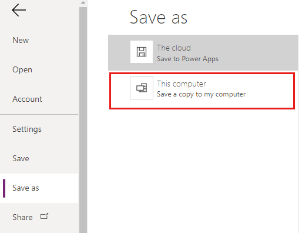
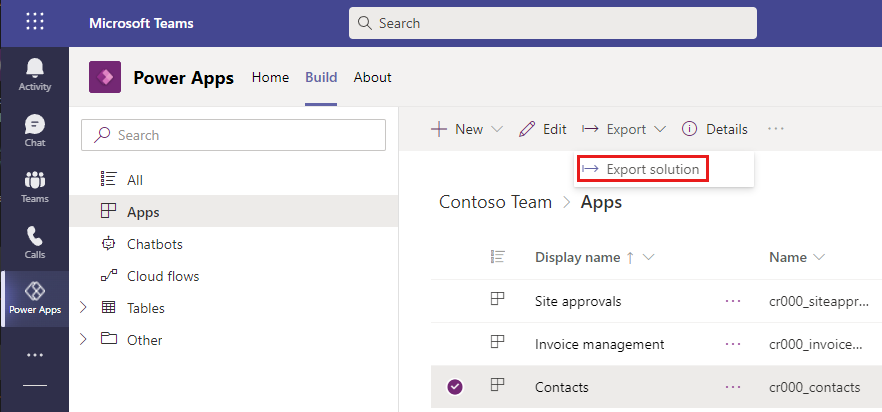

# Create a minimal repro canvas app

A minimal repro app is an app that contains the minimum amount of logic and controls to reproduce a problem. This app helps you narrow down and scope to the source of the issue, whether it might be with the data source, formulas, or a particular configuration.

After creating a minimal repro app, you can download a copy of it and share it with others, like in the [Power Apps community forum](https://powerusers.microsoft.com/t5/Power-Apps-Community/ct-p/PowerApps1) or with Microsoft support.

You can create a minimal repro app with one of the following methods.

- Create a blank app and add just the necessary connections and controls to demonstrate the problem.
- Make a copy of the original app and progressively remove irrelevant screens, controls and simplify formulas until the essence of the issue remains.

## Power Apps

1. Sign in to [Power Apps](https://make.powerapps.com/).
2. Open the app for editing.
3. Go to **File** > **Save as** > **This computer**.

    

The downloaded `.msapp` file can be opened by others using **File** > **Open** in [Power Apps](https://make.powerapps.com/).

## Microsoft Lists

1. Open the list.
1. Select **Integrate** > **Power Apps** > **Customize forms**. The customized form will open in Power Apps.
    
1. Select **Share** from menu at the top. The details page with the sharing panel will open.
    
1. Dismiss the sharing panel.
1. Select **Export package** in the menu bar.
    
1. Enter a name to the package. Review the exported content and select **Export**.

The downloaded zip file can be opened by others.

## Power Apps in Teams

1. In Microsoft Teams, go to the [Power Apps app list for your team](/power-apps/teams/manage-your-apps)
1. Select the app.
1. Select **Export solution** from the menu at the top.
    
1. Review the exported content and select **Export as zip**.

The downloaded zip file can be [imported](/power-apps/maker/canvas-apps/export-import-app#importing-a-canvas-app-package) by other users.

### Custom pages

Only custom pages in [unmanaged solutions](/power-platform/alm/solution-concepts-alm#managed-and-unmanaged-solutions#managed-and-unmanaged-solutions) can be exported. If the custom page is in a managed solution, ask the publisher of the solution to create an unmanaged solution that contains the custom page. You can also create a new unmanaged solution and create a new custom page there.

You can [export custom pages in an unmanaged solution](/power-apps/maker/data-platform/export-solutions) just like any other solution component. The downloaded zip file can be imported into any environment by other users.

## Privacy and security

Unauthorized users won't be able to access data sources in exported apps but they can see how the data sources are used in them. They can also see the app's controls and formulas. If an entire solution zip file is provided, assets like images are also visible.

Follow the below steps to help you limit privacy and security exposure before distributing the exported app:

- Don't include private and confidential information in the app. Check names of variables, controls, and other app elements that can inadvertently give away sensitive information.
- Create a new app from scratch instead of simplifying an existing production app. New app will also reduce the accidental exposure of sensitive information if you were to use the original app instead. Also, use of such a new app also reduces overhead for you to manually remove sensitive information fro the original app.
- Distribute just the `.msapp` file instead of the zip file. The `.msapp` file can be found inside the zip package.

## Next steps

[Ask a question with the Power Apps community](https://powerusers.microsoft.com/t5/Power-Apps-Community/ct-p/PowerApps1)
[Get Microsoft support](https://powerapps.microsoft.com/support/)

### See also

[Debugging canvas apps with Monitor](/power-apps/maker/monitor-canvasapps)
[Debugging model-driven apps with Monitor](/power-apps/maker/monitor-modelapps)
