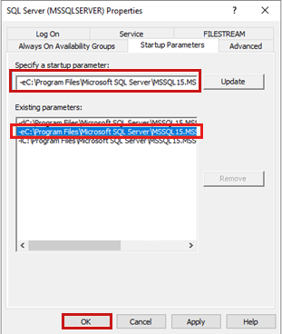

# Event ID 17058 and SQL Server doesn't start

_Applies to:_ &nbsp; SQL Server

## Symptoms

If the Microsoft SQL Server service can’t find the path that's configured to create error logs, the service doesn't start, and you receive  the following error message, depending on how you try to start the service:

- By using the Services applet:

  > `Windows could not start the SQL Server (MSSQLSERVER) service on Local Computer.`  
  > `Error 1067: The process terminated unexpectedly.`

- By using a command prompt:

    > The SQL Server (MSSQLSERVER) service is starting.  
    > The SQL Server (MSSQLSERVER) service could not be started.  
    > `A service specific error occurred: 13.`  
    > `More help is available by typing NET HELPMSG 3523.`

## Resolution

1. Check the Application log, and verify that you see an error message entry that resembles the following:

    > `Log Name:      Application`  
    > `Source:        MSSQLSERVER`  
    > `Date:          <Datetime>`  
    > `Event ID:      17058`  
    > `Task Category: Server`  
    > `Level:         Error`  
    > `Keywords:      Classic`  
    > `User:          N/A`  
    > `Computer:      <Server name>`  
    > `Description:  
    initerrlog: Could not open error log file 'C:\Program Files\Microsoft SQL Server\MSSQL15.MSSQLSERVR\MSSQL\Log\ERRORLOG'. Operating system error = 3(The system cannot find the path specified.).`  

2. Verify the path that's set for the ErrorLog file by using SQL Server Configuration Manager.

   

   You can also verify the path in the following registry entry:

   |Subkey|Data|
   |---|---|
   |`HKEY_LOCAL_MACHINE\SOFTWARE\Microsoft\Microsoft SQL Server\MSSQL15.MSSQLSERVER\MSSQLServer\Parameters\SQLArg1`|-eC:\Program Files\Microsoft SQL Server\MSSQL15.MSSQLSERVR\MSSQL\Log\ERRORLOG|
   |||

3. Try to copy the path, and then manually verify in Windows Explorer or at a command prompt that you can access the target in the path. (Be aware of typos, special characters, and copy-and-paste issues.)

   Here's an incorrect command example that includes a typo:

   ```console
   C:\>dir  "C:\Program Files\Microsoft SQL Server\MSSQL15.MSSQLSERVR\MSSQL\Log"
   ```

   > `The system cannot find the path specified.`

   Here's a correct command:

   ```console
   C:\>dir  "C:\Program Files\Microsoft SQL Server\MSSQL15.MSSQLSERVER\MSSQL\Log"
   ```

   > Volume in drive C is Windows  
   > Volume Serial Number is 40B5-7ED1  
   >
   > Directory of C:\Program Files\Microsoft SQL Server\MSSQL15.MSSQLSERVER\MSSQL\Log  
   >
   > \<Datetime>    \<DIR>          .  
   > \<Datetime>    \<DIR>          ..  
   > \<Datetime>            20,640 ERRORLOG  
   > \<Datetime>            14,082 ERRORLOG.1

4. Update the path to a valid folder in which the SQL Server startup account has permissions to create, read, write, and update files.

   

5. Restart the SQL Server service.
