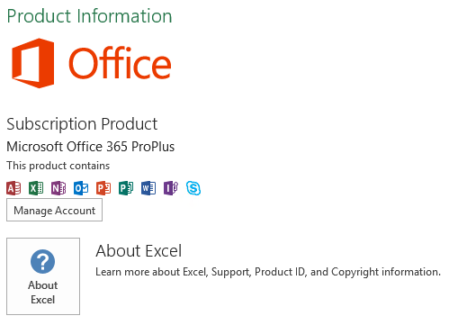

# Configure MSOLAP data provider for Excel to connect to Analysis Services

This article describes how to configure the correct MSOLAP data provider for Excel to connect to Analysis Services.

_Original product version:_ &nbsp; SQL Server 2017 Enterprise, SQL Server 2016 Enterprise, SQL Server 2014 Enterprise, SQL Server 2012 Enterprise, SQL Server 2008 Enterprise  
_Original KB number:_ &nbsp; 4488253

## Summary

To create a data connection to an Analysis Services data source, Microsoft Excel uses the Microsoft Analysis Services OLE DB Provider for Microsoft SQL Server (MSOLAP). Each version of Analysis Services has its own MSOLAP provider version. The following table lists the Analysis Service versions and their corresponding MSOLAP provider version.

|Analysis Services version|MSOLAP provider version|
|---|---|
| SQL Server 2008| MSOLAP.4 |
| SQL Server 2012| MSOLAP.5 |
| SQL Server 2014| MSOLAP.6 |
| SQL Server 2016| MSOLAP.7 |
| SQL Server 2017 and later versions| MSOLAP.8 (Considered evergreen)|
|||

For more information about MSOLAP and other client libraries for Analysis Services, review [Analysis Services client libraries](/analysis-services/client-libraries).

For more information about how to use the correct version of MSOLAP, see [Connection string properties](/analysis-services/instances/connection-string-properties-analysis-services). For legacy MSOLAP versions, please refer to [How to obtain the latest versions of MSOLAP](https://support.microsoft.com/help/2735567). For latest MSOLAP version, please refer to [Analysis Services client libraries](/analysis-services/client-libraries).

Excel uses the version of the MSOLAP provider that is installed on the client device. In the following example, Excel has configured MSOLAP.5 as the data provider in the data connection string.

  

On a client device that has multiple versions of the MSOLAP provider installed, Excel uses the version that's configured in the registry.

For example, in the following scenario:

- You have MSOLAP.5 installed and configured in the registry.
- You have installed MSOLAP.6 on your device to connect to Analysis Services 2014, but you have not updated the registry to reference MSOLAP.6.

Excel will configure the connection to use MSOLAP.5 in the connection string. This causes issues as you cannot use MSOLAP versions that are earlier than the data source version.  

## More information

To specify the version of MSOLAP that Excel uses, update the version in the registry keys. The following keys define which MSOLAP version Excel uses to connect to Analysis Services. The location of the registry key depends on whether Microsoft Office is an MSI or Click-to-Run (C2R) installation, and whether it's 32-bit or 64-bit.

- **Office 32-bit MSI**

  `HKEY_LOCAL_MACHINE\SOFTWARE\Classes\Wow6432Node\CLSID\{308FF259-8671-4df4-B66C-9851BFACF446}\ProgID\(Default)`  

- **Office 64-bit MSI**

  `HKEY_LOCAL_MACHINE\SOFTWARE\Classes\CLSID\{308FF259-8671-4df4-B66C-9851BFACF446}\ProgID\(Default)`  

- **Office 32-bit C2R**

  `HKEY_LOCAL_MACHINE\SOFTWARE\Microsoft\Office\15.0\ClickToRun\REGISTRY\MACHINE\Software\Classes\Wow6432Node\CLSID\{308FF259-8671-4df4-B66C-9851BFACF446}\ProgID\(Default)`

  or

  `HKEY_LOCAL_MACHINE\SOFTWARE\Microsoft\Office\ClickToRun\REGISTRY\MACHINE\Software\Classes\Wow6432Node\CLSID\{DBC724B0-DD86-4772-BB5A-FCC6CAB2FC1A}\ProgID`  

- **Office 64-bit C2R**  

  `HKEY_LOCAL_MACHINE\SOFTWARE\Microsoft\Office\15.0\ClickToRun\REGISTRY\MACHINE\Software\Classes\CLSID\{308FF259-8671-4df4-B66C-9851BFACF446}\ProgID\(Default)`

  or

  `HKEY_LOCAL_MACHINE\SOFTWARE\Microsoft\Office\ClickToRun\REGISTRY\MACHINE\Software\Classes\CLSID\{DBC724B0-DD86-4772-BB5A-FCC6CAB2FC1A}\ProgID\(Default)`  

The following is an example of Office 32-bit C2R configured to use MSOLAP.5:

To determine whether your installation is MSI or C2R, in Excel go to **File** > **Account**. If you see an **Office Updates** section, the installation is C2R:

If there's no **Office Updates** section, then it's an MSI installation:

To determine whether Excel is 32-bit or 64-bit, click **About Excel** in the same Accounts screen and it will show you in the dialog box at the top:

