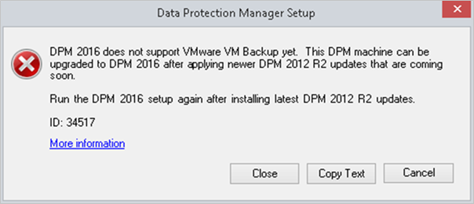

# How to upgrade DPM 2012 R2 to DPM 2016 if DPM 2012 R2 is used to protect VMware VMs

If you use Microsoft System Center 2012 R2 Data Protection Manager (DPM) to protect VMware virtual machines (VMs), you can't upgrade to System Center 2016 Data Protection Manager even after you stop the protection. In this situation, you receive the following error:

> 34517 - DPM 2016 does not support VMware VM Backup yet.



To fix this issue, follow the upgrade procedure in this article.

_Original product version:_ &nbsp; System Center 2012 R2 Data Protection Manager  
_Original KB number:_ &nbsp; 4039285

## Upgrade to DPM 2016

1. Open the System Center 2012 R2 DPM Administrator Console.
2. Stop the protection of the VMware VMs, and delete all VM backups. Make sure that you delete all backups on disks and online, including any inactive backups.
3. On the **Management** tab, select **Production Servers**, and then remove all VMware servers.
4. Select **Production Servers**, and then select **Manage VMware Credentials**.
5. Remove all the credentials from the **Manage VMware Credentials** dialog box.
6. Close the System Center 2012 R2 DPM Administrator Console.
7. Stop the following DPM services:

   - DPMAC
   - DPMAMService
   - DpmCPWrapperService
   - DPMLA
   - DPMRA
   - DPMVmmHelperService
   - DPMWriter
   - MSDPM
8. Open Windows PowerShell, use the **Run as administrator** option.
9. Run the following PowerShell command:

   ```powershell
   Enable-WindowsOptionalFeature –Online -FeatureName Microsoft-Hyper-V –All –NoRestart
   ```

10. Restart the DPM server to avoid a restart during the upgrade. Make sure that all DPM services listed in step 7 are in **Stopped** state.
11. Open SQL Server Management Studio, [back up the DPM database](/system-center/dpm/back-up-the-dpm-server#back-up-with-native-sql-server-backup-to-a-local-disk).
12. Download the [SQL script](remove-dpmdb-vmware-protection.md), and then run the script in SQL Server Management Studio.

    > [!NOTE]
    > If the script fails, the DPMDB database will continue to be in a good state. Save the output log from the SQL script for further debugging.
13. Open the System Center 2012 R2 DPM Administrator Console.
14. For each protection group that has a VMware VM as one of the protected data sources, follow these steps:

    1. Select **Modify Protection Group**.
    2. Follow the wizard to the last page without changing anything.
    3. On the last page, select **Update**.

    > [!NOTE]
    > These steps will cancel any running jobs for a protection group.
15. Close the System Center 2012 R2 DPM Administrator Console.
16. Start the upgrade to System Center 2016 Data Protection Manager.
