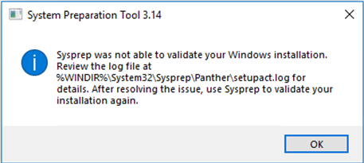

# MiracastView package cause sysprep error after you upgrade a computer to Windows 10 Version 1709

This article provides workarounds to an issue in which sysprep fails with an error after you upgrade a computer to Windows 10 Version 1709.

_Applies to:_ &nbsp; Windows 10, version 1709  
_Original KB number:_ &nbsp; 4057974

## Symptoms

Consider the following scenario:

- On a Windows 10 Version 1703 based computer, MiracastView is a built-in app and is installed by default.
- You upgrade the computer to Windows 10 Version 1709.
- You open a Command Prompt window with administrator permission and run the following command:

    ```console
    cd %windir%\System32\Sysprep
    sysprep.exe /generalize /oobe /reboot
    ```

In this scenario, the sysprep command fails. You receive an error message that resembles the following:



Additionally, the setupact log contains error messages that resemble the following:

> Date/Time, Error SYSPRP Package **Windows.MiracastView_6.3.0.0_neutral_neutral_cw5n1h2txyewy was installed for a user, but not provisioned for all users**. This package will not function properly in the sysprep image.  
Date/Time, Error SYSPRP Failed to remove apps for the current user: 0x80073cf2.  
Date/Time, Error SYSPRP Exit code of RemoveAllApps thread was 0x3cf2.  
Date/Time, Error SYSPRP ActionPlatform::LaunchModule: Failure occurred while executing 'SysprepGeneralizeValidate' from C:\\Windows\\System32\\AppxSysprep.dll; dwRet = 0x3cf2  
Date/Time, Error SYSPRP SysprepSession::Validate: Error in validating actions from C:\\Windows\\System32\\Sysprep\\ActionFiles\\Generalize.xml; dwRet = 0x3cf2R

When you use the Remove-AppxPackage PowerShell command to remove MiracastView, the command does not work, and you receive the following error message:

> Deployment Remove operation with target volume C: on Package Windows.MiracastView_6.3.0.0_neutral_neutral_cw5n1h2txyewy from: failed with error 0x80070490.  
See `http://go.microsoft.com/fwlink/?LinkId=235160` for help diagnosing app deployment issues.


## Cause

This issue occurs due to a bug in the way setup migrated the **Windows.MiracastView_6.3.0.0_neutral_neutral_cw5n1h2txyewy** package during the upgrade. This package will not function properly in the generalized image.

## Workaround

To work around this issue, use either of the following methods.

### Method 1

On the Windows 10 Version 1709 computer, copy Windows.MiracastView_6.3.0.0_neutral_neutral_cw5n1h2txyewy.xml from C:\\Windows.old\\ProgramData\\Microsoft\\Windows\\AppRepository\\ to C:\\ProgramData\\Microsoft\\Windows\\AppRepository.

### Method 2

Copy the C:\\Windows\\MiracastView folder from a Windows 10 Version 1703 computer to the Windows 10 Version 1709 computer. Then, restart the computer to let Windows finish uninstalling MiracastView.
