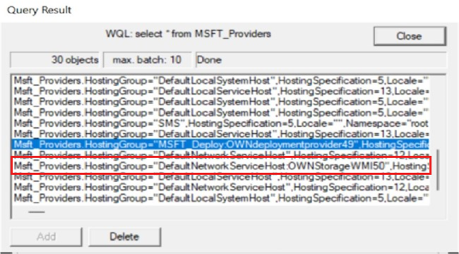

# How to use registry entries to configure standalone WMI providers

_Applies to:_ &nbsp; Windows 11

## Symptoms

You experience a quota overflow error in a Windows Management Instrumentation (WMI) shared provider host process (wmiprvse.exe).

## Resolution

The typical resolution for a WMIPrvSE.exe quota overflow is to configure standalone WMI providers. This custom configuration doesn't require administrative permissions.

In the past, you had to manually configure the providers. However, this article discusses a way to script these changes.

### Previous resolution: Manually configure providers

To configure standalone providers, you previously had to run the following manual steps by using a Windows PowerShell script or command prompt:

1. Stop the existing suspect WMIPrvSE.exe process to clean the memory that's set in the proportional set size (PSS). To do this, run the following command:

   ```powershell
   kill -f <pid of suspect wmiprvse.exe process>
   ```

   > [!NOTE]  
   > In this command, \<*pid of suspect wmiprvse process*> represents the process ID (PID) of the Wmiprvse.exe process that generated the issue.

1. Use the `OWN` HostingmodelGroup to move the target working provider away from the suspect provider host. (This was a WMIPrvSE.exe share that was typically set as `HostingModel='NetworkserviceHost'`). To do this, run the following command:

   ```powershell
   $prv = gcim -namespace root/standardcimv2 __win32provider -filter "name=<providername>"
   $prv.HostingModel = $Prv.HostingModel + ":OWN"
   ```

   > [!NOTE]  
   > In this command, \<*providername*> represents the name of the target working provider.

1. To set the new name, run the following command:

   ```powershell
   set-ciminstance -inputobject $prv
   ```

## New resolution

The new method for resolving this issue resembles the method that's discussed in [Registry Keys and Values for Controlling Provider Security](/windows/win32/wmisdk/registry-keys-for-controlling-provider-security). This method involves creating a new registry subkey that contains entries that represent a list of the providers that require standalone hosting.

> [!IMPORTANT]  
> If you have configured the provider security registry entries to run in secure or compatible mode, Windows ignores the **StandaloneProvider** entries.

The registry information uses the following structure:

- Subkey: **HKLM:\SOFTWARE\Microsoft\Wbem\CIMOM\StandaloneProviders**
- Entries (one per provider):
  - Name: ***Namespace*:__*TargetRelPath***
    > [!NOTE]  
    > In this string, *Namespace* represents the namespace of the target provider and *TargetRelPath* represents the relative path of the target provider. For example, **root\cimv2:__win32provider.name="MyProvider"**.
  - Value: ***Integer***
    > [!NOTE]  
    > In this string, *Integer* represents a unique numeric index that identifies the provider.

You can use Registry Editor to manually configure the registry, or you can use a PowerShell script.

The following example script configures the registry information for the **StorageWMI** provider, and assigns the information the index value **50**.

```powershell
$registryPath = "HKLM:\SOFTWARE\Microsoft\Wbem\CIMOM\StandaloneProviders"
$Name = "ROOT/Microsoft/Windows/storage __win32provider.name='StorageWMI'"
$value = "50"
IF(!(Test-Path $registryPath))
  {
    New-Item -Path $registryPath -Force | Out-Null
    New-ItemProperty -Path $registryPath -Name $name -Value $value -PropertyType String -Force | Out-Null
}
ELSE
{
    New-ItemProperty -Path $registryPath -Name $name -Value $value -PropertyType String -Force | Out-Null
}
```

This script checks whether the subkey exists. If the subkey doesn't exist, the script creates it. Then, it creates the subordinate entry for StorageWMI. After it makes this change, the provider runs in the standalone configuration, and the provider's hosting group information includes a string that resembles the following text:

```console
:OWNStorageWMI50
```

The following image shows how this listing appears in a list of providers.

  
