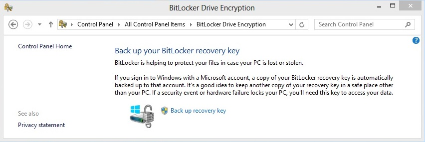
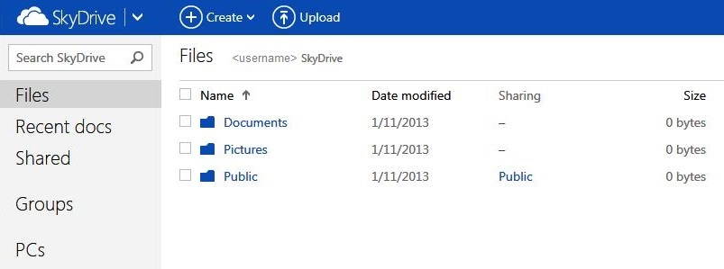
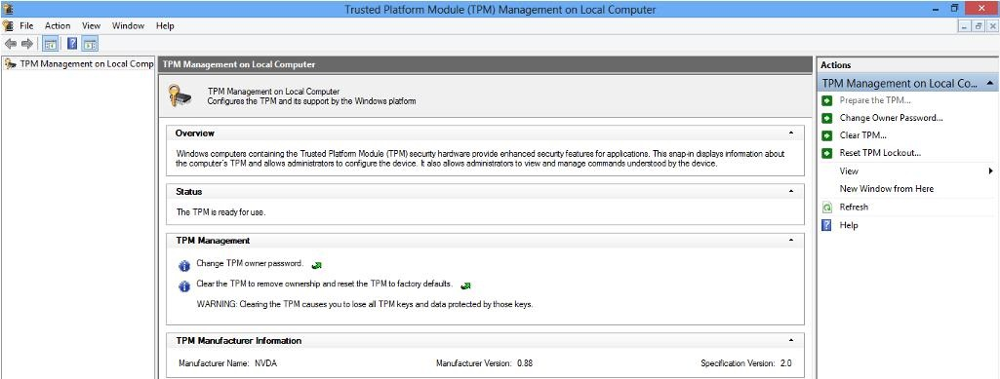
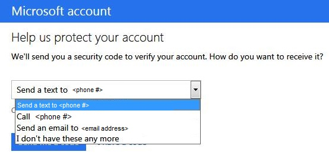
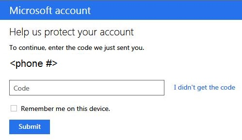

# How to enable BitLocker device encryption on Windows 8 RT

This document describes the workflow to enable BitLocker device encryption on the local hard disk of a Windows Surface computer that is running Windows 8 RT.

_Applies to:_ &nbsp; Windows 8  
_Original KB number:_ &nbsp;2855131

## Summary

The document makes the following points:

- Logons by guest accounts, local administrator accounts, or Microsoft accounts that are members of the guest group don't trigger BitLocker encryption of the local hard disk.  
- The first logon by a Microsoft account that is a member of the local computer's Administrators security group triggers BitLocker encryption of the local hard disk. A restart is required to complete the feature configuration.  
- The BitLocker recovery password is put on the OneDrive share of the administrator-enabled Microsoft account that triggered the encryption. That recovery key isn't visible on the OneDrive share when the share is viewed by using a web browser or a OneDrive viewing application.
- Windows Explorer displays a padlock next to local drives that are BitLocker encrypted.  
- BitLocker recovery keys may be obtained from the following website through an email message, a telephone call, or a text message:  
    [Find my BitLocker recovery key](https://windows.microsoft.com/recoverykey)  

## More information

> [!NOTE]
> The sizes of dialog boxes and other UI elements that are depicted in this article were changed. Changes include the placement of text in a dialog box and the size/aspect ratio.  

To see how the BitLocker device encryption workflow works, follow these steps:

1. On a new Windows 8 RT-based system, create a Guest account, and then log on by using that account.  

2. Check the BitLocker status in Control Panel. The Guest user can't invoke BitLocker encryption.

    

3. Create a Microsoft account, and then associate that account with the Guest account that you created in step 1.

    

4. Log off.  

5. Log on by using the Microsoft account that you created in step 3. Notice that the BitLocker add-in reports that the drive isn't protected.  

6. Restart the computer, and then log on again by using the Microsoft account that you created in step 3. Notice that the BitLocker protection status remains unchanged.  

    The net result is that logons that were made by using Microsoft accounts that are members of the Guest group don't trigger BitLocker encryption of the hard disk.  

7. Create a new local account that is a member of the local computer's Administrators security group. Notice that the BitLocker add-in reports that the drive isn't protected.  

8. Restart the computer. Again, notice that the BitLocker add-in reports that the drive isn't protected.  

    The net result is that user logons that were made by using local computer accounts that are members of the Administrators group don't trigger BitLocker encryption of the hard disk.  

9. Associate the administrator account that you created in step 7 with a new Microsoft account.  

10. Log on by using the Microsoft account that now has administrator permissions. Notice the following on-screen message:

    > Configuring Windows Feature  
    X % computer  
    Do not turn off your computer  

11. Restart the computer when you're prompted, and notice that the "Configuring Windows Feature" operation continues.  

    The net result is that the first logon by a Microsoft account that is a member of the local computer's Administrators group triggers BitLocker encryption of the local drive.  

12. Log on by using the Microsoft account that is a member of the Administrators group that you originally created in step 7. Notice the text change that is displayed by the BitLocker item in Control Panel.

    

13. The padlock icon in Windows Explorer reports that the local drive is BitLocker protected.

    

14. Notice that OneDrive never identifies the BitLocker recovery key.

    Even after the local drive is clearly BitLocker encrypted and the Control Panel UI says that the BitLocker recovery key is stored on the first logon of a Microsoft account that is a member of the local computer's administrative group, OneDrive doesn't show any BitLocker-related files.  

    

    The net result is that the OneDrive share for the administrator-enabled Microsoft account that triggered the BitLocker device encryption shows no files.  

15. Notice that the TPM.MSC snap-in displays a status of "The TPM is ready for use."

    

16. Connect to [Find my BitLocker recovery key](https://windows.microsoft.com/recoverykey). You see the following options:  

    

17. If you sent the recovery key by using a text message, the targeted phone will receive a text message that contains the Microsoft account security code. The text message resembles the following:

    

18. Type the code that you received in the text message into the [Find my BitLocker recovery key](https://windows.microsoft.com/recoverykey) wizard.

    

    The [Find my BitLocker recovery key](https://windows.microsoft.com/recoverykey)  wizard reports the BitLocker recovery key.

    
