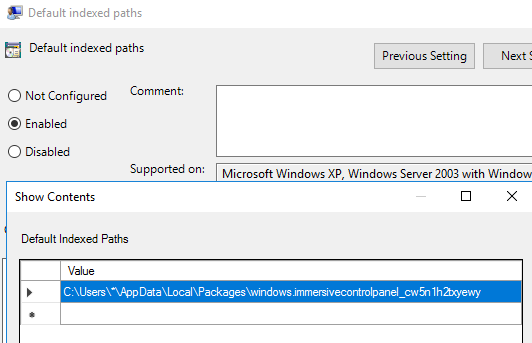

# High CPU usage when you search in the Settings app in Windows Server 2016

This article describes an issue in which you experience high CPU usage when you search in the **Settings** app in Windows Server 2016.

_Applies to:_ &nbsp; Windows Server 2016  
_Original KB number:_ &nbsp; 4504547

## Symptoms

In Windows Server 2016, you search on a term in the **Settings** app, as shown in the following screenshot:


When you start the search, you notice that the CPU usage is high.

> [!Note]
> This issue occurs only on Windows Server 2016. Windows Server 2019 and other client versions of Windows do not experience this issue.

## Cause

This issue occurs because the **Windows Search** (WSearch) service is disabled by default in Windows Server 2016. The **Settings** app (SystemSetting.exe) submits a query to the WSearch service when the service is disabled. Then, the **Settings** app tries to scan all contents that is stored in the following folder:

C:\\Users\\\<User Name>\\AppData\\Local\\Packages\\windows.immersivecontrolpanel_cw5n1h2txyewy\\LocalState\\Indexed\\Settings\\\<Locale>

This behavior causes high CPU usage for a certain period.

## Workaround

To work around this issue, the **Windows Search** (WSeach) service must be enabled. To do this, run the following command at an elevated command prompt that has administrator permissions:

```console
sc config WSearch start= auto
sc start WSearch
```  

## More information

To minimize CPU usage by the **Windows Search** service, specify and exclude the search path for WSearch. To do this, follow these steps.

1. Open Group Policy Management Console (gpmc.msc) on a domain controller (DC) in the environment.
2. Set the following policies:

    - **Computer Configuration > Administrative Templates > Windows Components > Search > Default excluded path**  

        To minimize the effect of enabling **Windows search**, set **Default excluded path** to: C:\\Users

        By default, C:\Users is always indexed. Therefore, you have to exclude the path manually if you want to reduce the performance effect of enabling the search service.

        

    - **Computer Configuration > Administrative Templates > Windows Components > Search > Default indexed path**  

        Set **Default indexed path** to: C:\\Users\\*\\AppData\\Local\\Packages\\windows.immersivecontrolpanel_cw5n1h2txyewy

        

Also, you can use the following policies, as necessary, to exclude indexing folders:

- Prevent indexing of certain file types
- Prevent indexing when running on battery power to conserve energy
- Prevent indexing certain paths
- Prevent indexing e-mail attachments
- Prevent indexing files in offline files cache
- Prevent indexing Microsoft Office Outlook
- Prevent indexing public folders
