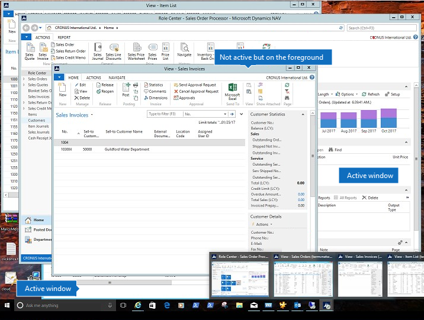

# Display issues occur when you deploy applications through RemoteApp Hi-Def mode

This article provides a workaround for display issues when you deploy applications through RemoteApp Hi-Def mode.

_Applies to:_ &nbsp; Windows Server 2012 R2, Windows 8.1  
_Original KB number:_ &nbsp; 3151708

## Symptoms

Consider the following scenario:

- You have a Windows Server 2012 R2 installation configured as a remote desktop.
- You have a client that's running Remote Desktop Connection (RDC) 8.1 or a later version.
- You start an application on a RemoteApp client computer.
- The RemoteApp is opened under Hi-Def mode (the default setting of Advanced RemoteFx support for RemoteApps).
- You open a child window of the application.

In this scenario, when you try to switch from the child window to the main window, artifacts of the child window obstruct the main window even though the main window is made active.

Also, when you hover over or try to click the visible child window, the movements and clicks are actually received by the active main window.

The following screenshot shows this issue. In this example, the Microsoft Dynamics NAV application is deployed as a remote app.

## Workaround

> [!IMPORTANT]
> Follow the steps in this section carefully. Serious problems might occur if you modify the registry incorrectly. Before you modify it, [back up the registry for restoration](https://support.microsoft.com/help/322756) in case problems occur.

To work around this issue, disable Hi-Def mode on the RDP client computer. To do this, follow these steps:

1. Click **Start**, type *regedit*, and then click **regedit.exe**.
2. In Registry Editor, locate the following subkey:

    `HKEY_CURRENT_USER\SOFTWARE\Microsoft\Terminal Server Client`
3. On the **Edit** menu, point to **New**, and then click **DWORD Value**.
4. In the **New Value #1** box, type *EnableAdvancedRemoteFXRemoteAppSupport*, and then press Enter.
5. Right-click **EnableAdvancedRemoteFXRemoteAppSupport**, and then click **Modify**.
6. In the **Value data** box, type *0*, and then click **OK**.
7. Exit Registry Editor.

## More information

For more information about Hi-Def RemoteApp, see the following Remote Desktop Services Blog article:

[RemoteApp improvements in Windows Server 2012 R2](https://blogs.msdn.microsoft.com/rds/2013/11/25/remoteapp-improvements-in-windows-server-2012-r2/)
